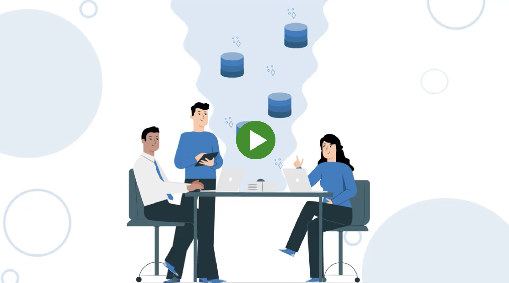

<p align="center">
  
</p>

---

## What is ScalarDB?
ScalarDB is a universal HTAP engine. It achieves ACID transactions and real-time analytics across diverse databases to simplify the complexity of managing multiple databases.

<p align="center">
  <a href='https://www.youtube.com/watch?v=lW6nCEJV-gs' target="_blank"></a>
</p>

## Quickstart

1. Start running transactions.
   - **Get started with ScalarDB Core:** To set up a basic application by using Java, see [Getting Started with ScalarDB](https://scalardb.scalar-labs.com/docs/latest/getting-started-with-scalardb).
   - **Get started with ScalarDB Cluster (for enterprise customers):** To set up a basic application that uses ScalarDB Cluster through the Java API, see [Getting Started with ScalarDB Cluster](https://scalardb.scalar-labs.com/docs/latest/scalardb-cluster/getting-started-with-scalardb-cluster).
2. To set up and run various samples instances, see the [list of ScalarDB sample applications](https://scalardb.scalar-labs.com/docs/latest/scalardb-samples/).
3. Learn about the [configurations for ScalarDB Core](https://scalardb.scalar-labs.com/docs/latest/configurations) and the [configurations for ScalarDB Cluster](https://scalardb.scalar-labs.com/docs/latest/scalardb-cluster/scalardb-cluster-configurations).
4. Learn about features, such as:
   - [User authentication/authorization](https://scalardb.scalar-labs.com/docs/latest/scalardb-cluster/scalardb-auth-with-sql)
   - [Attribute-based access control](https://scalardb.scalar-labs.com/docs/latest/scalardb-cluster/authorize-with-abac)
   - [Vector search](https://scalardb.scalar-labs.com/docs/latest/scalardb-cluster/getting-started-with-vector-search)

For additional documentation, visit [ScalarDB Documentation](https://scalardb.scalar-labs.com/docs/latest/).

## Install

The library is available on [maven central repository](https://mvnrepository.com/artifact/com.scalar-labs/scalardb).
You can install it in your application using your build tool such as Gradle and Maven.

To add a dependency on ScalarDB using Gradle, use the following:
```gradle
dependencies {
    implementation 'com.scalar-labs:scalardb:3.15.2'
}
```

To add a dependency using Maven:
```xml
<dependency>
  <groupId>com.scalar-labs</groupId>
  <artifactId>scalardb</artifactId>
  <version>3.15.2</version>
</dependency>
```

## Contributing

This library is mainly maintained by the Scalar Engineering Team, but of course we appreciate any help.

* For asking questions, finding answers and helping other users, please go to [stackoverflow](https://stackoverflow.com/) and use [scalardb](https://stackoverflow.com/questions/tagged/scalardb) tag.
* For filing bugs, suggesting improvements, or requesting new features, help us out by opening an issue.

### Pre-commit hook

This project uses [pre-commit](https://pre-commit.com/) to automate code format and so on as much as possible. If you're interested in the development of ScalarDB, please [install pre-commit](https://pre-commit.com/#installation) and the git hook script as follows.

```
$ ls -a .pre-commit-config.yaml
.pre-commit-config.yaml
$ pre-commit install
```

The code formatter is automatically executed when committing files. A commit will fail and be formatted by the formatter when any invalid code format is detected. Try to commit the change again.

### Exception and log message guidelines

All the exception and log messages in this project are consistent with the following guidelines:

- The first character is capitalized.
- The message does not end with a punctuation mark.

When contributing to this project, please follow these guidelines.

## License

ScalarDB is dual-licensed under both the Apache 2.0 License (found in the LICENSE file in the root directory) and a commercial license.
You may select, at your option, one of the above-listed licenses.
The commercial license includes several enterprise-grade features such as ScalarDB Cluster, management tools, and declarative query interfaces like GraphQL and SQL interfaces.
For more information about the commercial license, please [contact us](https://www.scalar-labs.com/contact).
