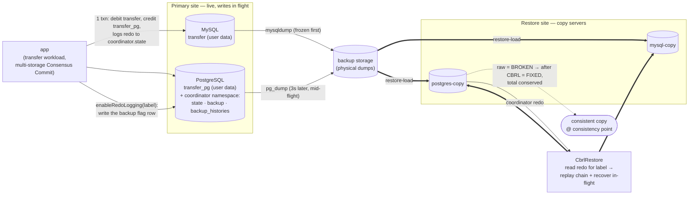

# CBRL end-to-end demo (docker-compose)

Demonstrates Coordinator-Based Redo Logging (CBRL) restore, end-to-end, entirely through
an **isolated** docker-compose project. It runs a conserved-total balance-transfer
workload against a **multi-storage** ScalarDB (user data split across MySQL and
PostgreSQL, the Consensus Commit coordinator in PostgreSQL), takes
**non-snapshot-consistent** physical backups of both databases *while writes are in
flight*, restores them into separate copy servers, then uses the coordinator redo to
repair the copy into a transactionally consistent state.

This is a **correctness test**, not just a smoke test. Right after the physical restore —
before CBRL — a **negative control** reads the raw copy off storage (bypassing the
transaction layer, whose lazy recovery would mask the damage) and asserts it is **BROKEN**:
its grand total has drifted from the initial one and/or it holds in-flight
(non-`COMMITTED`) records. That proves CBRL is actually needed. CBRL then replays the redo,
and a **strong oracle** asserts the copy is **FIXED** — every account present in each
namespace, every record a `COMMITTED` Consensus Commit record, and the grand total restored
to the initial one (checked both raw and transactionally). The demo thus shows:
**raw copy = BROKEN → CBRL replay → FIXED.**

Everything runs against the **locally-built** CBRL-enabled ScalarDB (`4.0.0-SNAPSHOT`)
in this worktree — the published artifact has no CBRL.

## Run it

```bash
# Requires Docker Desktop running. From this directory:
bash run.sh            # build + full pipeline, ending in the conserved-total check
bash run.sh down       # tear everything down (containers, network, volumes)
```

Single steps are available too:
`bash run.sh <build|up|schema|populate|open|workload|restore-load|check-raw|expire|cbrl-restore|check|down>`,
and `bash run.sh resume` runs the second half (open → workload+backup → restore → check)
on an already-seeded primary.

Expected shape of a successful run (the negative control BEFORE CBRL, then the oracle
AFTER; the exact sums and drift vary per run — the drift is even signed differently run to
run — but the raw grand total is never `2000000` and the fixed one always is):

```
=== Check-raw (negative control): assert the RAW restored copy is INCONSISTENT before CBRL ===
NEGATIVE CONTROL: raw physical state of the copy BEFORE CBRL (no recovery)
  transfer     sum=1007395, rows=100/100, in-flight(non-COMMITTED)=2, missing=0, out-of-range=0, duplicates=0
  transfer_pg  sum=993957, rows=100/100, in-flight(non-COMMITTED)=3, missing=0, out-of-range=0, duplicates=0
  grand total = 2001352, initial total = 2000000, drift = 1352
NEGATIVE CONTROL PASS: raw copy is BROKEN as expected (total-drifted=true, in-flight-records=true, incomplete=true).
...
=== Check (final oracle): copy is complete + all-COMMITTED + conserved on the restored copy ===
FINAL ORACLE: raw physical state of the copy AFTER CBRL
  transfer     sum=1005952, rows=100/100, in-flight(non-COMMITTED)=0, missing=0, out-of-range=0, duplicates=0
  transfer_pg  sum=994048, rows=100/100, in-flight(non-COMMITTED)=0, missing=0, out-of-range=0, duplicates=0
  grand total = 2000000, expected = 2000000
  transactional re-read: grand total = 2000000 (200/200 rows present)
PASS: restored copy is complete, all-COMMITTED, and conserved (raw + transactional).
```

## Architecture (isolated compose project `cbrl-demo`)

Dedicated network `cbrl-demo-net`, named volumes, nothing published to the host. Inside
the network the app reaches the databases by service hostname (`mysql:3306` /
`postgres:5432`).



| Service | Role |
| --- | --- |
| `mysql` | `transfer` service namespace (user data) — **primary** |
| `postgres` | `transfer_pg` service namespace + `coordinator` (state + CBRL redo/backup) — **primary** |
| `mysql-copy` / `postgres-copy` | restore targets (same namespaces, same names) |
| `app` | local CBRL runner (one-shot jobs; profile `tools`) |

The shared `cbrl-backups` volume (mounted at `/backups` on every DB service) holds the
physical dumps: primaries write them, copies read them.

### The one host build step

The only thing built on the host is the ScalarDB **schema-loader shadow (fat) jar**
(`./gradlew :schema-loader:shadowJar`, driven by `run.sh build`). Because schema-loader
depends on `:core`, that one fat jar bundles **core + CBRL + the JDBC drivers + the
`SchemaLoader` entrypoint + the SPI service files** — a superset of everything every
demo step needs. The `Dockerfile` copies it into a slim `eclipse-temurin:8` image and
compiles the two demo sources (`driver/CbrlDemoDriver.java`, `src/CbrlRestoreMain.java`)
against it, so a single image runs every ScalarDB step:

- `com.scalar.db.schemaloader.SchemaLoader --coordinator …` — schema + coordinator tables
- `CbrlDemoDriver populate|open|transfer|check …` — the standalone core-only workload/verifier
- `CbrlDemoDriver restore …` → `CbrlRestoreMain` → `CbrlRestore` — the redo replay/repair

### Pipeline order (`run.sh`)

1. `up` the four DB containers, wait healthy.
2. **schema** — `schema-loader --coordinator` on the primaries creates the service
   tables, `coordinator.state`, and the CBRL `coordinator.backup` table.
3. **populate** — seed 100 accounts/namespace at balance 10000 (window **closed**, so
   this pre-window base is carried only by the physical copy).
4. **open** — `enableRedoLogging(label)` writes the `BACKING_UP` row and enables redo
   logging; wait the cache interval.
5. **workload** — the cross-storage transfer runs for 30s; each transfer debits an
   account in `transfer` (MySQL) and credits one in `transfer_pg` (PostgreSQL) in a
   single transaction, so every commit spans both storages + the PG coordinator, and its
   redo is logged. **The backups are taken mid-flight**: MySQL is dumped first, then —
   after a deliberate `BACKUP_GAP_SECONDS` (default 3s) during which transfers keep
   committing — the PG+coordinator dump is taken last. That gap guarantees cross-storage
   commits land on the PG side but not the frozen MySQL side, so the raw copy is broken
   (and the coordinator backup is a superset of the user dumps).
6. **restore-load** — load the dumps into the copy servers.
7. **check-raw** (negative control) — read the raw copy off storage (no recovery) and
   assert it is BROKEN: grand total drifted from `2000000` and/or in-flight
   (non-`COMMITTED`) records present and/or rows missing. Fails loudly if the copy is
   already consistent (CBRL would not have been exercised).
8. **expire** — wait past the transaction lifetime so orphaned in-flight records can
   self-abort during recovery.
9. **cbrl-restore** — `CbrlRestore` reads the redo off the restored coordinator,
   recovers each in-flight copy record, replays the committed redo, and writes the result
   back via the Storage API.
10. **check** (final oracle) — assert the copy is FIXED: exactly 100 rows per namespace
    (no missing/extra/duplicate accounts), every record a `COMMITTED` Consensus Commit
    record (zero in-flight), and the grand total back to `2 * 100 * 10000 = 2000000`,
    confirmed both by a raw storage scan and a transactional re-read.

## Notes

- `scalar.db.cross_partition_scan.enabled=true` is required in the properties because
  `CbrlRestore` scans the whole `coordinator.state` table (a `ScanAll`) to read the redo;
  multi-storage propagates this global flag to each sub-storage.
- The recovery `WARN`/`NoMutationException` lines during the heavily-concurrent workload
  and during restore are normal Consensus Commit lazy-recovery contention, not failures.
- Files: `docker-compose.yml`, `Dockerfile`, `run.sh` (orchestration),
  `container/*.properties` (service-hostname configs baked into the image),
  `driver/CbrlDemoDriver.java`, `src/CbrlRestoreMain.java`,
  `schema/transfer-multi-storage-schema.json`. The fat jar is staged into `app/` by
  `run.sh build` (git-ignored).
