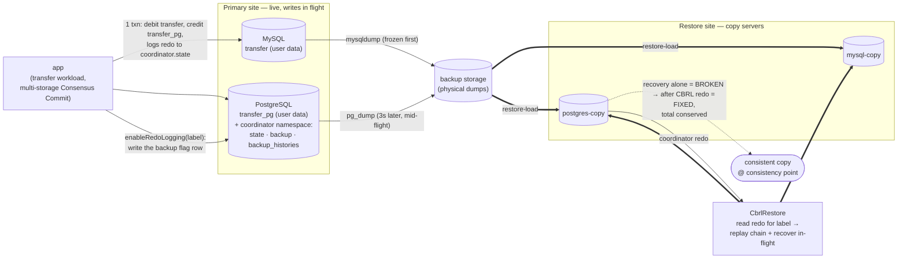

# CBRL end-to-end demo (docker-compose)

Demonstrates Coordinator-Based Redo Logging (CBRL) restore, end-to-end, entirely through
an **isolated** docker-compose project. It runs a conserved-total balance-transfer
workload against a **multi-storage** ScalarDB (user data split across MySQL and
PostgreSQL, the Consensus Commit coordinator in PostgreSQL), takes
**non-snapshot-consistent** physical backups of both databases *while writes are in
flight*, restores them into separate copy servers, then uses the coordinator redo to
repair the copy into a transactionally consistent state.

This is a **correctness test**, not just a smoke test, and it isolates exactly what the CBRL
redo buys. Both runs validate the copy the same way: a single Consensus Commit cross-partition
`ScanAll`, which applies Consensus Commit lazy recovery to every in-flight record it reads.

`run-all-without-cbrl` stops after the physical restore, so that `ScanAll` observes the copy
after recovery **alone** and must find it **still BROKEN**, with its grand total drifted from
the initial one. This is the honest negative control: recovery resolves in-flight records, but
it cannot reconstruct a committed write that never reached the frozen-earlier storage (such a
record reads back as a valid `COMMITTED` row carrying a stale value), so only the redo can
repair it. `run-all-with-cbrl` first replays the coordinator redo, and the same `ScanAll` then
asserts the copy is **FIXED**: every account present in each namespace and the grand total
restored to the initial one. The demo thus shows: **recovery alone = BROKEN → CBRL redo → FIXED.**

Everything runs against the **locally-built** CBRL-enabled ScalarDB (`4.0.0-SNAPSHOT`)
in this worktree — the published artifact has no CBRL.

## Run it

```bash
# Requires Docker Desktop running. From this directory:
bash run.sh                       # run both variants: WITHOUT CBRL (expect broken), then WITH CBRL (expect fixed)
bash run.sh run-all-without-cbrl  # stop before the redo; the ScanAll oracle must find the copy STILL broken
bash run.sh run-all-with-cbrl     # include the redo replay; the ScanAll oracle must find the copy fixed
bash run.sh down                  # tear everything down (containers, network, volumes)
```

Each `run-all-*` resets the volumes first, so the with-CBRL run repairs its own independent,
freshly torn copy. Single steps are available too:
`bash run.sh <build|up|schema|populate|cbrl-open|workload|backup|restore-load|expire|cbrl-restore|validate [primary|restored] [consistent|broken]|down>`,
and `bash run.sh resume-without-cbrl` / `resume-with-cbrl` run the second half (window phase →
restore → validate) on an already-seeded primary. Run the validation on its own with `bash run.sh
validate` to report the copy's current state (rows, grand total, drift), or `bash run.sh validate
primary` to check the live primary right after `populate` (no restore-load needed); add `consistent`
or `broken` to turn the report into an assertion.

Expected shape of a successful run (the without-CBRL oracle finds the copy still broken after
recovery, then the with-CBRL oracle finds it fixed). The exact sums and drift vary per run, and
the drift is even signed differently run to run, but the without-CBRL grand total is never
`10000000` and the with-CBRL one always is:

```
=== PHASE 1/2 — WITHOUT CBRL (expect BROKEN) ===
...
=== Validate restored (expect broken): Consensus Commit ScanAll ===
Consensus Commit ScanAll: transfer=500/500 rows, transfer_pg=500/500 rows, grand total = 9998132, expected = 10000000, drift = -1868
PASS (expect broken): still inconsistent after recovery alone, which only the redo can repair (complete=true, conserved=false).
...
=== PHASE 2/2 — WITH CBRL (expect FIXED) ===
...
=== Validate restored (expect consistent): Consensus Commit ScanAll ===
Consensus Commit ScanAll: transfer=500/500 rows, transfer_pg=500/500 rows, grand total = 10000000, expected = 10000000, drift = 0
PASS (expect consistent): complete and conserved.
```

## Architecture (isolated compose project `cbrl-demo`)

Dedicated network `cbrl-demo-net`, named volumes, nothing published to the host. Inside
the network the app reaches the databases by service hostname (`mysql:3306` /
`postgres:5432`).



| Service | Role |
| --- | --- |
| `mysql` | `transfer` service namespace (user data) — **primary** |
| `postgres` | `transfer_pg` service namespace + `coordinator` (state + CBRL redo/backup) — **primary** |
| `mysql-copy` / `postgres-copy` | restore targets (same namespaces, same names) |
| `app` | local CBRL runner (one-shot jobs; profile `tools`) |

The shared `cbrl-backups` volume (mounted at `/backups` on every DB service) holds the
physical dumps: primaries write them, copies read them.

### The one host build step

The only thing built on the host is the ScalarDB **schema-loader shadow (fat) jar**
(`./gradlew :schema-loader:shadowJar`, driven by `run.sh build`). Because schema-loader
depends on `:core`, that one fat jar bundles **core + CBRL + the JDBC drivers + the
`SchemaLoader` entrypoint + the SPI service files** — a superset of everything every
demo step needs. The `Dockerfile` copies it into a slim `eclipse-temurin:8` image and
compiles the two demo sources (`driver/CbrlDemoDriver.java`, `src/CbrlRestoreMain.java`)
against it, so a single image runs every ScalarDB step:

- `com.scalar.db.schemaloader.SchemaLoader --coordinator …` — schema + coordinator tables
- `CbrlDemoDriver populate|open|transfer|validate …` — the standalone core-only workload/verifier
- `CbrlDemoDriver restore …` → `CbrlRestoreMain` → `CbrlRestore` — the redo replay/repair

### Pipeline order (`run.sh`)

Both variants share the same setup and differ only in the tail. `bash run.sh` runs them back to
back, resetting the volumes between so each starts from a clean, independently torn copy.

**Shared setup (both variants):**

1. `up` the four DB containers, wait healthy.
2. **schema** — `schema-loader --coordinator` on the primaries creates the service
   tables, `coordinator.state`, and the CBRL `backup` / `backup_histories` tables.
3. **populate** — seed `NUM_ACCOUNTS` accounts total (default 1000, split evenly so 500 per
   namespace) at balance 10000 (window **closed**, so this pre-window base is carried only by the
   physical copy).
4. **window phase** — three separate steps run concurrently: the **workload** commits in the
   background the whole time while **cbrl-open** and **backup** fire mid-run, so the app never
   pauses for the backup (`RPO > 0`).
   - 4a. **workload** — the cross-storage transfer. Each transfer debits an account in `transfer`
     (MySQL) and credits one in `transfer_pg` (PostgreSQL) in a single transaction, so every commit
     spans both storages plus the PG coordinator. Its first `WARMUP_SECONDS` (default 8s) run before
     any window is open, so those commits are the pre-window base carried only by the physical copy.
   - 4b. **cbrl-open (mid-run)** — once the warm-up elapses, `enableRedoLogging(label)` writes the
     single `backup` flag row while the workload keeps committing; after the cache interval each
     process's daemon observes it and in-window commits log full redo.
   - 4c. **backup (mid-flight)** — `mysqldump` first; then, after `BACKUP_GAP_SECONDS` (default 3s)
     during which transfers keep committing, the `pg_dump` (PG + coordinator) last. The gap
     guarantees cross-storage commits land on the PG side but not the frozen MySQL side, so the
     copy is torn (and the coordinator backup is a superset of the user dumps).
5. **restore-load** — load the dumps into the copy servers.
6. **expire** — wait past the transaction lifetime so orphaned in-flight records self-abort
   when recovery next reads them.

**`run-all-without-cbrl` tail:**

7. **`validate broken`** — read the copy through a single Consensus Commit cross-partition
   `ScanAll`, which triggers lazy recovery on every in-flight record it touches, then evaluate the
   same two invariants the with-CBRL run checks: completeness (500 rows per namespace) and
   conservation (grand total `= 10000000`). Assert they do **not** both hold, so the copy is **still
   BROKEN** after recovery alone; in practice the total is still drifted, which only the redo can
   repair. Fails loudly if the copy is already consistent (the torn-write scenario was not produced,
   so CBRL was not exercised).

**`run-all-with-cbrl` tail:**

7. **cbrl-restore** — `CbrlRestore` reads the redo off the restored coordinator, recovers each
   in-flight copy record, replays the committed redo, and writes the result back via the Storage
   API.
8. **`validate consistent`** — the identical step and `ScanAll` with the same two invariants, now
   asserted to **both** hold: the copy is **FIXED**, with 500 rows per namespace and the grand total
   back to
   `2 * 500 * 10000 = 10000000`.

## Notes

- `scalar.db.cross_partition_scan.enabled=true` is required in the properties because both
  `CbrlRestore` (scanning the whole `coordinator.state` table to read the redo) and the
  `validate` step (a Consensus Commit `ScanAll` of each user table) issue cross-partition scans;
  multi-storage propagates this global flag to each sub-storage.
- The recovery `WARN`/`NoMutationException` lines during the heavily-concurrent workload
  and during restore are normal Consensus Commit lazy-recovery contention, not failures.
- Files: `docker-compose.yml`, `Dockerfile`, `run.sh` (orchestration),
  `container/*.properties` (service-hostname configs baked into the image),
  `driver/CbrlDemoDriver.java`, `src/CbrlRestoreMain.java`,
  `schema/transfer-multi-storage-schema.json`. The fat jar is staged into `app/` by
  `run.sh build` (git-ignored).
