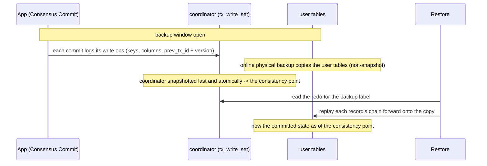
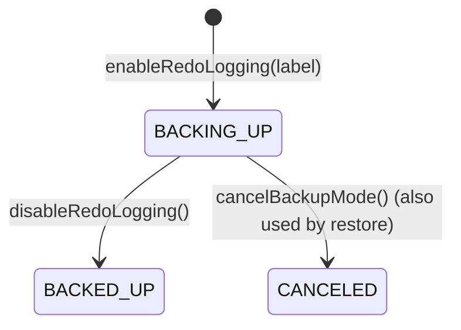
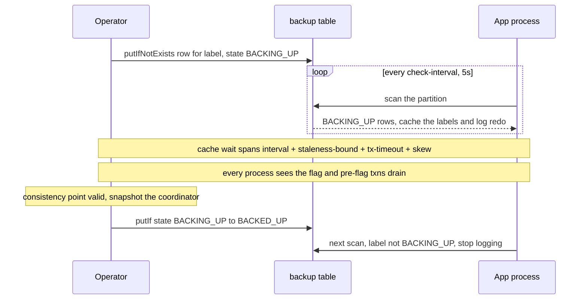
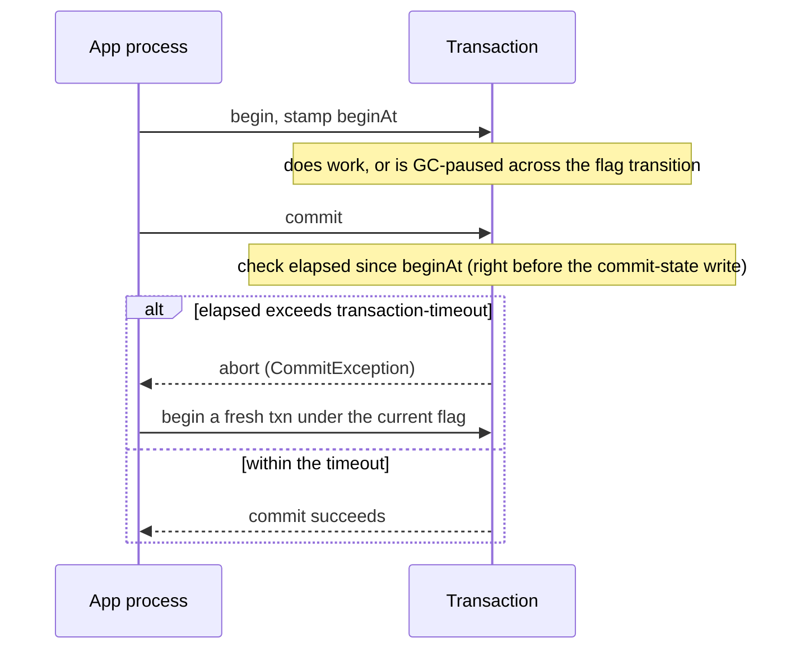

# CBRL — Design: backup and restore

Status: **PoC.** The restore/replay engine and the *enter/exit* half of the embedded-Core backup-mode
machinery are implemented and exercised end-to-end by a containerized demo (single-Postgres +
single-MySQL). The backup-flag lifecycle (enter/exit/cancel) is implemented; several production
preconditions below are **designed but not yet enforced** — see *Assumptions & preconditions* and
*Known gaps* before relying on this beyond the demo. This is an overall design; it describes the
concept, not every implementation detail.

A plain physical backup of ScalarDB's databases, taken online while transactions keep running, is
**not** transactionally consistent: a record may be caught mid-commit, stale, or missing, and
different records reflect different points in time. Coordinator-Based Redo Logging (CBRL) makes such a
backup consistent **after the fact** — during a backup window it logs each commit's write operations
into the coordinator, and at restore it replays that redo onto the copy to reconstruct the exact
committed state as of a **consistency point**. It is the same record-level redo idea as ScalarDB
Cluster's Semi-Synchronous Replication (SSR), applied in place to a backup rather than shipped to a
remote site. Correctness rests on the preconditions in *Assumptions & preconditions* — when any of
them is violated the restore is silently wrong, not erroring.

## Requirements & goals

The consistency contract CBRL targets (from the product owner): **database consistency is required;
client-ACK inconsistency is allowed.**

- **Goal** — the restored databases are transactionally consistent: atomic across databases, a prefix of
  the commit history, and per-record coherent.
- **Non-goal** — zero acknowledged-write loss. `RPO > 0` is acceptable, so CBRL **never blocks a commit
  to wait for durability**; it logs the redo in the same commit and reconstructs consistency after the
  fact. A window-time commit that is lost is an RPO matter, not a consistency violation.

## Backup phase

- **Open a backup window.** While it is open, every Consensus Commit transaction logs its **write
  operations** into the coordinator's own `tx_write_set` column. Capture rides on the normal commit —
  it only stamps the write set into the coordinator row the commit already writes, so there is no
  extra transaction and no extra round trip.
- **Each write operation** records, for one record: its keys, the new column values (a DELETE carries
  no columns), and a **chain link** — the previous committed version's transaction id (`prev_tx_id`)
  and this write's version (`tx_version`). The record's own transaction id is the enclosing
  coordinator row's id (parent + child for group commit), not stored per operation. That link is what
  lets restore order writes per record without trusting wall-clock time.
- **Copy the user tables** with an ordinary **online physical backup** (`pg_dump`/`mysqldump` or a
  storage snapshot) taken while the database keeps serving — a **non-snapshot-consistent copy**.
  Replay tolerates this because it walks each record forward.
- **Snapshot the coordinator table last, and atomically.** Its set of committed transactions *defines*
  the consistency point (why it must be atomic and last is in *Assumptions & preconditions*). Because
  the redo lives in `tx_write_set` and each commit time in `tx_created_at`, one atomic backup of the
  coordinator captures both — there is no separate redo log or timestamp export to manage.

### Backup mode — entering and quitting (embedded Core)

The backup window must be turned on and off across **every app process** (each embedding ScalarDB
Core). Embedded Core has no control plane to push a flag to every process, so the flag lives in a
coordinator-DB table that each process reads on a periodic, cached poll. (In ScalarDB Cluster the flag
can be pushed directly, like pause, so none of this machinery is needed — the concern below is
specifically embedded Core.)

**The flag table `<coordinator-ns>.backup`.** One row per backup. The **partition key is a fixed
constant** so every row lives in one partition, and the **`label` is the clustering key** — so the
daemon lists all backups with an ordinary **single-partition scan** (not a cross-partition one),
returned sorted by label. Created alongside `coordinator.state`; timestamps are `BIGINT` epoch-millis.

| column | type | notes |
|---|---|---|
| `id` | TEXT (PK) | fixed constant (e.g. `"backup"`) — co-locates every row in one partition |
| `label` | TEXT (CK) | the backup label, usually its timestamp; also the redo's `EntryGroup.backup_label` and the `CbrlRestore` argument |
| `state` | TEXT | lifecycle (below); a process logs redo **iff** `state = BACKING_UP` |
| `created_at`, `updated_at` | BIGINT | backup started / last transition |
| `updated_by` | TEXT | operator id (observability) |

**Lifecycle.** The state machine is below: `enterBackupMode` (`→ BACKING_UP`), `exitBackupMode`
(`BACKING_UP → BACKED_UP`), and `cancelBackupMode` (`BACKING_UP → CANCELED`) are all implemented, and
`CbrlRestore` calls `cancelBackupMode` at the end of a restore to neutralize any resurrected
`BACKING_UP` row (see *Redo bloat carried forward on restore* under *Known gaps*). Each transition is a
`putIf` on the current `state`; re-opening an already-`BACKING_UP` label is idempotent success, and
transitioning a label that is not in the required state is rejected.

**Protocol.** Each app process runs a daemon that polls the flag table every `check-interval` and
caches the set of `BACKING_UP` labels; `begin()` reads the cache (not the DB) to decide logging.

**Keeping the backup complete.** Because the poll is periodic, three mechanisms *aim* to ensure no
window-time commit goes unlogged. They reduce the risk to a high-probability mitigation, **not an
absolute guarantee** (see *Known gaps*):

- **Cache wait** — after opening the window, wait until every process has seen the flag and pre-flag
  transactions have drained before trusting the consistency point. This is a manual, unverified sleep;
  there is no readiness probe.
- **`begin()` freshness** — `begin()` uses the cache but forces a synchronous scan if the cache is
  older than the staleness bound; once the flag has been read at least once, if it still can't be
  confirmed `begin()` **fails closed** (refuses), so a process resuming from a stall — or during a
  coordinator partition — can't begin under a stale flag.
- **Transaction timeout** — a transaction self-aborts (as a `CommitException`) if it runs longer than
  `transaction-timeout`, killing one frozen across the transition. The check runs once, right before
  the coordinator commit-state write (the point of no return), so a slow prepare or validation can no
  longer let an unlogged commit land arbitrarily late. It is **global and always-on** (default 60s,
  independent of `check-interval`), applied to *every* Consensus Commit transaction. That breadth is a
  deliberate **trade-off**, not a defect: the timeout is what bounds the pre-flag drain, so the cache
  wait above must cover it. An OLTP workload keeps the 60s default; a workload with legitimately long
  transactions raises the timeout and accepts a proportionally longer cache wait.

## Restore phase

Restore replays the logged write operations onto the copy, walking each record forward to the
consistency point. The result is a **consistent prefix** — the committed state as of the consistency
point — **provided the capture was complete and the preconditions held** (replay cannot detect an
incomplete capture; see *Known gaps*). Restore uses the **Storage API only**: no transaction of its
own, and no extra coordinator bookkeeping.

The operator physically restores the coordinator and user tables first, then runs restore for a chosen
**backup label** — the coordinator's `tx_write_set` is long-lived and shared, so multiple windows' redo
accumulate in it and restore must replay **only** the label being restored. Replaying an older window's
redo would resurrect deleted records: one inserted in an earlier window, then physically deleted during
a logging-off gap (delete unlogged) and absent from the copy, would have its stale earlier-window INSERT
replayed against the absent base and wrongly come back. The label is the discriminator — not cleanup
ordering, not `created_at`. For each record, restore recovers the copy's in-flight version, reads it as
the base, replays the chain forward, and writes the result back with the Storage API. Records are
routed by the namespace and table carried in their redo, so one run spans every namespace the window
touched. Each reconstructed record is stamped with its **original** commit time (the coordinator's
`tx_created_at`, not the restore-time clock), so `tx_committed_at` stays faithful and valid for later
Consensus Commit time-based logic; restore trusts the coordinator backup's time over the record's own
column, which record recovery may have re-stamped.

**Resolving order — the tx-id chain.** Order is resolved **per record** by the chain, exactly as in
SSR. Suppose three transactions commit in order T0 < T1 < T2:

- T0 inserts K-A, K-B, K-C
- T1 updates K-A, K-B
- T2 deletes K-A, K-C

The write operations, each carrying `previous txn ID -> current txn ID`, grouped per record:

- **K-A:** INSERT (null -> T0), UPDATE (T0 -> T1), DELETE (T1 -> T2)
- **K-B:** INSERT (null -> T0), UPDATE (T0 -> T1)
- **K-C:** INSERT (null -> T0), DELETE (T0 -> T2)

Each operation's `previous txn ID` must match the `current txn ID` of the operation before it, so
K-A's only valid order is INSERT(->T0), UPDATE(T0->T1), DELETE(T1->T2) — whatever order the operations
happen to be read in. So the order is fixed by the chain, not by arrival order or any timestamp (the
chain-only rule below says why timestamps are never trusted).

**The chain-only rule.** Replay decides what to apply **only** from the `prev_tx_id -> tx_id` chain —
never from `created_at` or `tx_version`. Both are *carried* on the redo (so a restored record stays
valid for later Consensus Commit logic), but neither may gate a replay decision:

- `created_at` is a wall-clock stamp, and CBRL is **multi-primary** (different processes commit with
  unsynchronized clocks), so it is skew-prone and gives no reliable per-record order. It is used *only*
  as a try-order optimization (independent INSERT roots oldest-first, as SSR does); the chain still
  governs the outcome, so that can never change a correct result.
- `tx_version` gives an order but not a *linkage* — restore rolls the copy forward from whatever version
  it happened to catch, and picking the next write needs "this write's before-image is exactly that
  version," which `prev_tx_id -> tx_id` states directly. It also assumes a dense, gap-free sequence, but
  window-scoped logging never captures the versions below the copied base, and it **resets on
  delete→reinsert**, so a re-inserted record's versions can collide with its prior incarnation's.

The replay primitive is **SSR's** (`RecordApplyService`), reused; this rule is the one constraint to
honor on top of it, not a new algorithm.

Replay starts from whatever version the copy caught for a record and follows the chain **forward** to
the consistency point:

- If the copy caught **K-A at T1**, replay applies only DELETE (T1 -> T2); the INSERT and UPDATE are
  already reflected in the copied version and are skipped.
- If the copy has **no record** (absent, or an in-flight one that recovers to absent), replay starts
  from the INSERT root (null -> T0) and follows forward.

**Delete then re-insert — multiple chain segments.** A record can be deleted and inserted again, so it
has **more than one INSERT root**: every INSERT starts a fresh chain with `prev_tx_id = null`.
Extending K-A above (which ended with DELETE at T2), suppose it is re-inserted and updated:

- segment 1: INSERT (null -> T0), UPDATE (T0 -> T1), DELETE (T1 -> T2)
- segment 2: INSERT (null -> T3), UPDATE (T3 -> T4)

The two segments are **not** linked — the DELETE does not point to the later INSERT. Replay walks a
segment forward until it reaches a DELETE (record now deleted), then resumes from the next unused
INSERT root, finishing at the surviving segment's terminal version (alive at T4 here). For a
well-formed, chain-closed backup this is order-independent: exactly one root survives, so the order the
roots are tried in never changes the outcome (ordering roots by commit time is only a try-order
optimization, and the reproducible tiebreak used *only if* a malformed backup left two live roots).
Because DELETE is a **logical tombstone**, a deleted-then-reinserted record still carries its chain
position: replay marks the caught version *and its chain-ancestors* (walking `prev_tx_id` back) as
**reflected** and never re-applies a reflected INSERT root. For example, if the copy caught K-A at T4
and a later `DELETE (T4 -> T5)` was logged: replay marks T4 and its ancestor T3 reflected, applies the
delete (K-A now absent), then re-tries segment 1 — which again ends in `DELETE (T1 -> T2)` — and skips
the reflected re-insert root T3. So K-A ends **absent**, never revived to the re-inserted version it
already reflects. (Below-base segments are always safe to re-try: a re-insert is only possible after a
delete, so such a segment must end in a DELETE.)

**Crash-safety.** Write-back is per record, not atomic, so a crash mid-restore leaves a partial set.
Safety comes from **convergence, not atomicity**: re-running from the same backup re-derives the
identical state per record and overwrites any partial ones (recovery is a no-op on already-committed
records, and replay is idempotent — a re-insert is deduped, never applied twice). A Byteman crash test
injects failures at each restore stage and asserts a re-run converges.

**Windowed repair.** Under window-scoped logging a record's chain root can predate the window and never
be captured, so the first in-window operation links below the copied version. Such below-the-base
operations are skipped — the copy already reflects them — so a record whose history predates the window
still restores correctly.

## Configuration

- `scalar.db.consensus_commit.backup.check_interval_millis` — daemon poll interval (default 5000 ms;
  recommended 5–10s).
- `scalar.db.consensus_commit.backup.staleness_bound_millis` — oldest cache `begin()` accepts before a
  forced fresh scan (default ~`3 × check_interval`).
- `scalar.db.consensus_commit.transaction_timeout_millis` — **global** transaction-lifetime bound,
  independent of the check interval (default 60000 ms / 1 min); see *Known gaps*.
- `scalar.db.cross_partition_scan.enabled=true` — required by restore, which scans the coordinator
  table for redo.
- Restore concurrency: `replay_buckets` / `replay_workers` (each key's whole recover→replay→write-back
  pipeline runs on the one worker that owns its bucket).

## Implementation notes

- **Restore engine (built):** `CbrlRestore` → per-key buckets that **spill to temp files**
  (`RecordShuffler`/`RedoBucket`) → `RecordApplier`. Each key is owned by one worker (bucketed by key),
  so replay needs no locks or CAS: per key it recovers via `recoverRecord`, reads the base,
  chain-replays, and writes back — and a large window's redo never sits in the heap at once. Capture uses
  `WriteSetEncoder`; the redo proto (`WriteSet`/`EntryGroup`/`Entry`) carries `backup_label`,
  `prev_tx_id`, `tx_version`, and columns in the coordinator's `tx_write_set`.
- **Backup mode (partly built):** a `coordinator.backup` `TableMetadata` wired into
  `ConsensusCommitAdmin`, a `BackupModeDaemon` (the cached poll), `enableRedoLogging` /
  `disableRedoLogging` / `cancelBackupMode` writing the row, and `begin()` reading the daemon cache and
  stamping the begin time. Enter/exit/cancel are wired; restore calls `cancelBackupMode` to neutralize a
  resurrected window.

## Assumptions & preconditions

Correctness depends on all of these; violating any is a **silent** wrong restore. Of the three
correctness-critical ones below, **cleanup suspension is now enforced** (in `finishTransaction`); the
atomic coordinator snapshot is the backup tool's job, and coordinator-restored-first is not yet
enforced.

### Atomic coordinator snapshot, taken strictly last

The coordinator copy *defines* the consistency point, so it must be a single-point-in-time,
read-from-committed snapshot (e.g. `pg_dump --single-transaction` on a single DB), and it must be taken
**after** every user-table snapshot. A torn or multi-partition read of the coordinator can include a
transaction but miss one it read from (non-serializable restore); and because redo only rolls records
*forward* to the cut, a user record newer than the cut cannot be rolled back — so every user-table copy
must be no newer than the coordinator snapshot and should itself be single-instant (`mysqldump
--single-transaction`/InnoDB, or a quiesced storage snapshot).

*To enforce:* mandate a single-DB coordinator with an atomic dump; record the max user-snapshot
completion time and verify the coordinator snapshot began after it; reject multi-partition coordinator
backends that cannot snapshot atomically.

### Coordinator-state cleanup suspended for the window

This is the one correctness guarantee CBRL must provide itself — the atomic snapshot is the backup
tool's job, and consistent-prefix and cross-DB atomicity are inherited (see *Inherited properties*).

`finishTransaction` deletes a committed transaction's coordinator row *and its `tx_write_set` redo*. If
that runs during a window, the redo is gone before the coordinator copy → the record is rolled back at
restore and lost.

**Enforced (core path).** `finishTransaction` **skips** the state-row deletion while a backup window is
open: it still runs the per-record recovery and returns normally — it does *not* throw, so it never
disrupts a transaction whose caller finishes it during a backup — and only the row reclamation is
deferred until the window closes, when a later cleanup pass reclaims the still-present row. The check
reuses the backup-mode daemon and **fails closed**: if backup mode cannot be confirmed, the delete is
skipped too. This is the complete core enforcement — `deleteState` has exactly one caller
(`finishTransaction`), and lazy recovery deliberately never deletes coordinator state. A **Cluster-side
coordinator GC**, if one exists, would need its own equivalent skip.

### Coordinator restored before user records are recovered

`CbrlRestore` recovers in-flight copy records against the restored coordinator; if the coordinator
isn't fully restored first, an ancient PREPARED record is judged expired and rolled back (committed
write lost), with no error.

*To enforce:* at restore start, assert the restored coordinator table is present/non-empty; and when a
copy record is PREPARED but its writer's coordinator state is absent, fail closed (throw) instead of
letting recovery age-abort it.

### Single active window

The write path stamps one `EntryGroup.backup_label` per commit, so only one `BACKING_UP` label may be
open at a time (see the multi-window gap under *Known gaps*).

### Inherited properties (not CBRL's to provide)

Two correctness properties are listed so they aren't mistaken for CBRL mechanisms — CBRL only has to
avoid breaking them:

- **Consistent prefix** (the cut has no dangling read-dependency) is produced by the atomic coordinator
  snapshot above.
- **Cross-DB atomicity** (a multi-database transaction restores all-or-nothing) comes from Consensus
  Commit's single commit record per transaction, given restore replays only `COMMITTED` redo and treats
  a coordinator row's `EntryGroup`s as all-or-nothing.

## Known gaps

Ranked roughly by severity — residual limitations to harden or accept for the PoC.

- **Completeness is undetectable.** Replay cannot distinguish a dropped mid-chain op from a
  legitimately-below-base op, so any capture hole yields a wrong-but-plausible record, never an error.
  The preconditions above exist to prevent capture holes; there is no post-restore integrity check.
- **Multi-window mis-attribution.** `enableRedoLogging` doesn't check for a *different* open label, so a
  second window can open; the write path then logs all redo under the first sorted label, silently
  corrupting the other backup. The `>1 BACKING_UP` log is after-the-fact detection, not prevention.
- **Restore still holds the commit-time map in heap.** The redo now **spills to per-bucket temp files**
  — restore streams the coordinator scan straight into the spill files and replays one bucket at a
  time, so the redo is no longer heap-bound (raise `replay_buckets` to shrink each bucket). The one
  structure still held whole is the txId→commit-time map (built for *all* committed-with-redo rows,
  before the label filter); it is small per entry (a tx id plus a `long`), so it is acceptable for the
  PoC (see *Future improvements* for the large-window path). Restore is also still single-JVM (no
  sharding across processes).
- **Write-set size vs backend item limits.** The redo is an inline BLOB on the coordinator row
  (aggregated across children under group commit); on DynamoDB (400 KB) / Cosmos (2 MB) a large or
  batched transaction that commits normally can fail *only while a window is open*.
- **Redo bloat carried forward on restore (window resurrection fixed).** The `backup` table is in the
  backed-up coordinator namespace, so its rows return with a restore. The phantom-window problem is
  fixed: restore transitions any resurrected `BACKING_UP` row to `CANCELED` (`cancelBackupMode`), so the
  restored cluster's daemon does not re-enter backup mode. What remains is bloat — the restored
  coordinator still carries every window's `tx_write_set` blob on its committed rows (and the terminal
  flag rows), which normal coordinator cleanup should reclaim; putting the flag table in an excluded
  system namespace would also keep it out of the backup set.

## Future improvements

- **Spill the commit-time map to a file-based store.** The txId→commit-time map is the one restore
  structure still held whole in the heap (see *Known gaps*). It is small per entry, so it is fine for
  the PoC; for a very large or long-lived window it should be backed by an embedded file-based
  key-value store rather than the heap — the same treatment the redo already gets with per-bucket spill
  files.
