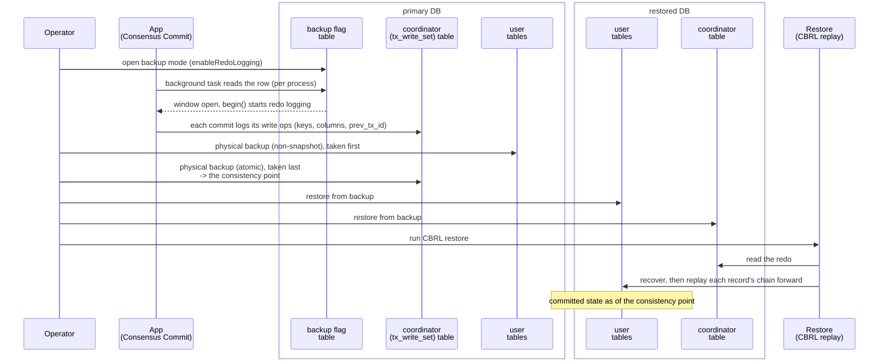

# Coordinator-Based Redo Logging (CBRL)

Status: **PoC.** Backup-window management, redo capture, and restore replay are implemented and
tested. Several operational safeguards described below are not yet enforced automatically.

CBRL makes an online physical backup of ScalarDB databases transactionally consistent after restore.
While a backup window is open, Consensus Commit stores each committed transaction's writes in its
coordinator row. After the user databases and coordinator are restored, CBRL replays those writes to
restore the committed state recorded by the coordinator snapshot.

The target is **database consistency**, not preserving every acknowledged write. Transactions absent
from the coordinator snapshot may be lost. A transaction included in that snapshot must be restored
completely; missing its redo is a consistency failure.



## Correctness contract

The restored databases represent one valid point in the commit history, with each transaction applied
to every database it changed, if all of these conditions hold:

1. All user-table copies finish before the coordinator snapshot begins.
2. The coordinator snapshot is atomic and read-from-committed state.
3. Every transaction that may be included in that snapshot either began under the backup window and
   logged redo, or completed before the trusted consistency point.
4. Coordinator rows containing window redo are not deleted before the coordinator snapshot.
5. The coordinator is restored completely before user-record recovery or replay starts.
6. Restore selects the exact backup window being restored.

Replay cannot prove that these conditions held. Missing redo can produce a plausible but incorrect
result, so the backup workflow must enforce them.

## Coordinator data

The coordinator's `state` row already carries a write set in `tx_write_set`: master writes it for
active recovery, recording each record's primary key only. CBRL reuses that column. While a backup
window is open it enriches each commit's write set with:

- the full user columns of each write (not just the key), so replay can rebuild the record;
- `prev_tx_id` per operation, the previous committed version's transaction ID, the chain link replay
  orders by;
- `tx_version` per operation, the record's resulting version, carried so restore stamps a coherent
  version (not used for ordering);
- `backup_label` per `EntryGroup`, the backup window the commit belonged to, the discriminator
  restore replays by.

Restore stamps each rebuilt record with the original commit time from `tx_created_at`, already on the
row. The record's current transaction ID is the enclosing coordinator entry's ID, and `prev_tx_id`
links each operation to the version it follows; that link is the ordering relation replay uses.

Two additional coordinator tables manage backup windows:

### `backup`

This table tells processes whether a backup is running. It has a fixed partition key and no clustering
key, so it contains at most one row. A row means a backup is running; no row means it is not.

| Column | Type | Meaning |
|---|---|---|
| `id` | TEXT, PK | Fixed key such as `backup` |
| `label` | TEXT | Window identifier stamped into redo |
| `created_at` | BIGINT | Open time in epoch milliseconds |
| `updated_by` | TEXT | Operator identifier |

Opening uses `putIfNotExists`, so a second backup cannot start while one is already running.

### `backup_histories`

This append-only table records completed and canceled backups for operators. Restore does not depend
on it.

| Column | Type | Meaning |
|---|---|---|
| `label` | TEXT, PK | Window identifier |
| `created_at` | BIGINT | Open time |
| `state` | TEXT | `BACKED_UP` or `CANCELED` |
| `closed_at` | BIGINT | Close time |
| `updated_by` | TEXT | Operator identifier |

Each label must identify exactly one backup. The current implementation does not prevent reuse. Reusing
a label can make restore select changes from multiple backups. Production use therefore requires a new
label for every backup; the implementation should eventually generate an ID that can never be reused.

## Backup protocol

1. **Provision the coordinator schema.** `state`, `backup`, and `backup_histories` must exist before
   any transaction manager is used. A missing or unreadable `backup` table makes `begin()` refuse the
   transaction.
2. **Open the window.** `enableRedoLogging(label)` conditionally creates the fixed `backup` row.
3. **Wait for the consistency point to become safe.** Every library process polls the row and caches
   its label. The operator waits long enough for all processes to observe the window and for
   transactions that began before observation to finish or time out.
4. **Copy all user databases.** These may be online, non-atomic copies. Each individual copy must not
   contain data newer than the later coordinator snapshot.
5. **Snapshot the coordinator last.** This must be a single-point-in-time snapshot of committed
   coordinator state. It defines the consistency point.
6. **Close the window.** `disableRedoLogging()` appends `BACKED_UP` history best-effort and deletes the
   live row with a label condition.

The saved backup should include a metadata file that lists the backup ID, coordinator snapshot, user
table copies, and whether all copies completed. Restore must reject missing, incomplete, or mismatched
metadata. This check is designed but not implemented.

### Library-mode propagation

Each `ConsensusCommitManager` runs a background task that performs a strongly consistent read of the
single `backup` row every
`backup.check_interval_millis`. `begin()` captures one cached label for the transaction. If the cache
has never been populated or is older than `backup.staleness_bound_millis`, it performs a synchronous
read. If the flag cannot be confirmed, `begin()` throws instead of starting an unlabeled transaction.

Processes do not report that they have seen the row, so the operator still waits for a fixed amount of
time. There is no automatic check proving that every process is ready. Flag reads are serialized.
The periodic poll and the on-demand read in `begin()` share one refresh path that reads and publishes
under a single lock, so a slow read cannot overwrite a newer observation and let an unlabeled
transaction start.

ScalarDB Cluster can propagate the flag through its control plane; the polling mechanism described
here is for library mode.

### Transactions spanning the transition

A transaction records its window label at `begin()`. Transactions begun before a process observes the
window therefore remain unlabeled. A global transaction lifetime limit bounds how long such a
transaction may remain able to commit. The timeout is checked immediately before the coordinator
commit-state write and raises `CommitException` when exceeded.

This is a mitigation, not a strict elapsed-time guarantee: a process can pause after the timeout check,
and group-commit batching can add delay before the durable state write. The operator wait must include
the polling delay, staleness bound, transaction timeout, expected scheduling delay, and clock margin.

### Coordinator-row retention

`finishTransaction()` normally deletes the committed coordinator row, including its redo. During an
open or unconfirmable window it performs record recovery but skips that deletion. This preserves redo
until the coordinator snapshot.

The current library path has no later cleanup pass dedicated to rows retained this way, so they can
remain until another cleanup mechanism removes them. Any Cluster-side coordinator GC must independently
honor the same retention rule.

## Restore protocol

1. Restore the coordinator completely.
2. Restore all user-table copies.
3. Verify the backup metadata and select its unique window ID.
4. Scan committed coordinator entries containing redo for that window.
5. Finish or roll back each copied record's unfinished transaction state.
6. Replay each record's redo chain forward from the copied version.
7. Write the reconstructed record with its original `tx_created_at`.
8. Cancel a live backup row resurrected from the coordinator snapshot so the restored deployment does
   not remain in backup mode.

The metadata validation in step 3 is not implemented. Cancellation checks the label, occurs after
successful replay, and failures are currently reported without failing the completed restore.

### Parallelism

Steps 4-7 run in parallel. Redo is partitioned into `replay_buckets` buckets by record key, and
`replay_workers` workers each own the full recover, replay, and write-back pipeline for the keys in
their buckets. Because each key belongs to exactly one bucket owned by one worker, replay needs no
locks or CAS, and a record's whole chain is always applied in order by a single worker.

### Replay ordering

Replay is per record and uses only the `prev_tx_id -> tx_id` chain to decide which mutation follows the
copied version. It does not use wall-clock commit time or `tx_version` for correctness:

- Commit time is unsafe for ordering across processes with unsynchronized clocks. It may only decide
  which unrelated insert to try first.
- `tx_version` orders versions but does not identify the exact predecessor, can have gaps below the
  copied version, and resets after delete/reinsert.

For example, operations `INSERT(null -> T0)`, `UPDATE(T0 -> T1)`, and `DELETE(T1 -> T2)` have only one
valid chain regardless of scan order. If the copy contains T1, restore applies only the delete. If the
copy is absent, restore starts at the insert.

### Delete and reinsert

A delete followed by a later insert creates separate chain segments because each insert has
`prev_tx_id = null`:

```text
INSERT(null -> T0) -> DELETE(T0 -> T1)
INSERT(null -> T2) -> UPDATE(T2 -> T3)
```

Replay processes a segment through its delete and then considers another unused insert. It marks
the copied version and its ancestors as already reflected so a later delete cannot revive an insert
already represented by the copy. For a complete, valid backup, replay produces the same result
regardless of which insert it tries first.

### Changes older than the copied record

Window-scoped logging may begin in the middle of a record's history. An operation whose predecessor is
older than the copied version is skipped because the copy already reflects that history. This is why
an absent link is not by itself evidence of missing redo, and why restore cannot detect every missing
change.

### Crash behavior and resource use

Write-back is atomic per record, not across the restore. Re-running restore from the same backup
calculates and overwrites each record in the same way, so running restore again repairs a partial run.

Each bucket spills to a temporary file, and a worker reads a whole bucket into memory, so peak heap
depends on bucket skew and worker count, not only total redo size. The transaction-ID-to-commit-time
map is still held entirely in heap.

## Configuration

- `scalar.db.consensus_commit.backup.check_interval_millis`: background polling interval; default
  5000 ms.
- `scalar.db.consensus_commit.backup.staleness_bound_millis`: maximum accepted cache age before a
  synchronous read; default three times the polling interval. A non-positive value disables freshness
  enforcement and is unsafe for the backup protocol.
- `scalar.db.consensus_commit.transaction_timeout_millis`: global transaction lifetime limit; default
  60000 ms. It applies even when no backup is running.
- `scalar.db.cross_partition_scan.enabled=true`: required for the coordinator redo scan.
- `replay_buckets` and `replay_workers`: restore partitioning and concurrency.

## Implementation map

- Capture: `WriteSetEncoder`, `WriteSet`/`EntryGroup`/`Entry`, and `coordinator.tx_write_set`.
- Window control: `Coordinator`, `BackupModeDaemon`, `ConsensusCommitManager`, and
  `ConsensusCommitAdmin`.
- Restore: `CbrlRestore`, `RecordShuffler`, `RedoBucket`, and `RecordApplier`.

`RecordApplier` is a local implementation modeled after ScalarDB Cluster's Semi-Synchronous
Replication (SSR). It follows the same record-restoration idea but does not reuse SSR code.

## Known gaps

- Processes do not report when they have seen the backup row, so the operator uses a fixed wait that
  cannot prove every process is ready.
- The implementation does not prevent reuse of a backup label.
- Saved backups have no metadata file proving which copies belong together and completed successfully.
- Coordinator completeness is not verified before recovery.
- `upgrade()` adds columns to `state` but does not create `backup` or `backup_histories`. Existing
  deployments must provision them before rolling the new library. Manager construction also does not
  validate the complete schema; failure appears at `begin()`.
- Retained coordinator rows have no dedicated post-window cleanup pass.
- One-phase Consensus Commit is forced to two-phase while labeled. Transactions using
  `TwoPhaseConsensusCommit` do not capture CBRL redo and are outside this design.
- Inline redo can exceed backend item limits, notably DynamoDB's 400 KB and Cosmos DB's 2 MB limits.
- Restore cannot distinguish missing redo from legitimate changes older than the copied version.
- Restore keeps the commit-time map and each concurrently processed bucket in heap and runs in one JVM.
- A restored coordinator retains old `tx_write_set` blobs until normal coordinator cleanup removes
  them.

## Future work

Priorities are to let every process report when it is ready, generate backup IDs that cannot be
reused, validate backup metadata before restore, provision and validate coordinator schema during
upgrade/startup, and add bounded cleanup for retained coordinator rows. For large restores, move the
commit-time index to an embedded file-backed store and bound bucket memory independently of key skew.
