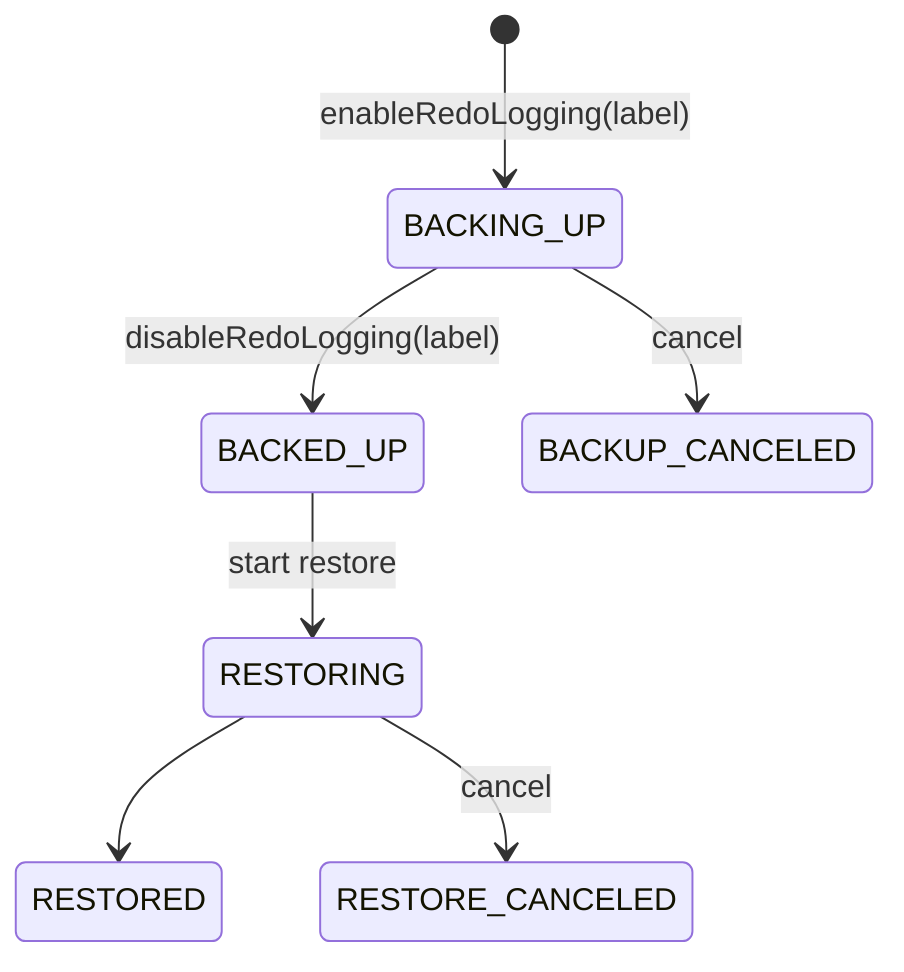
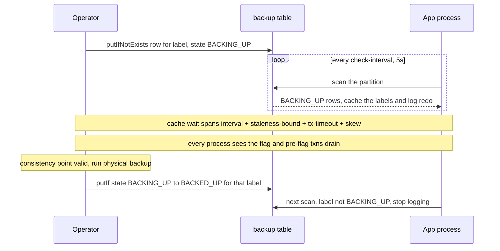
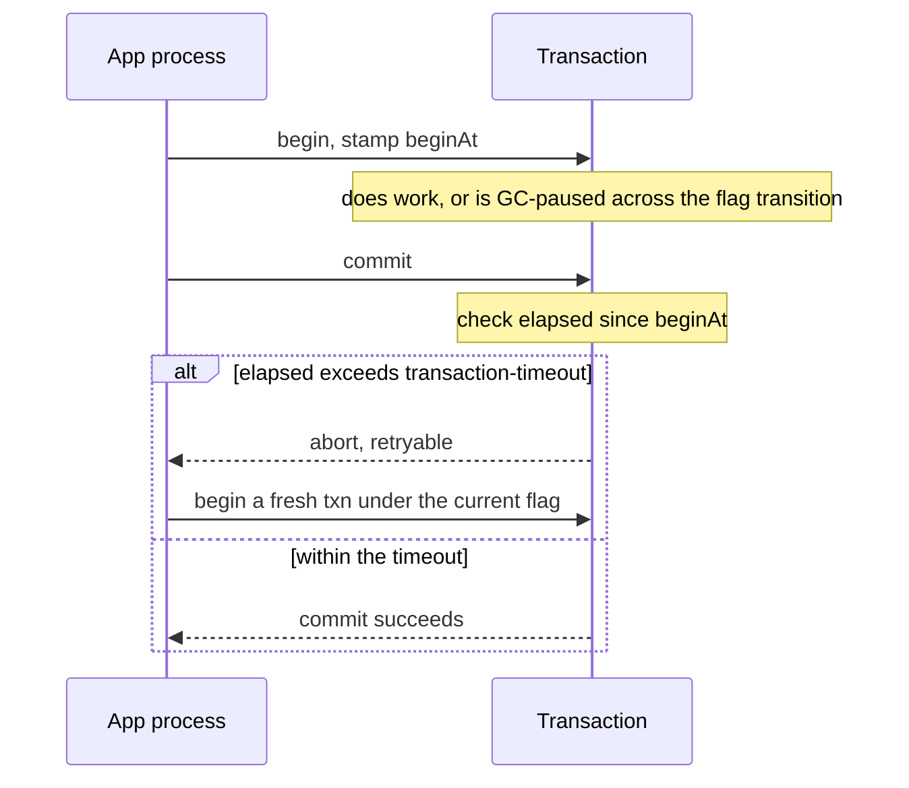
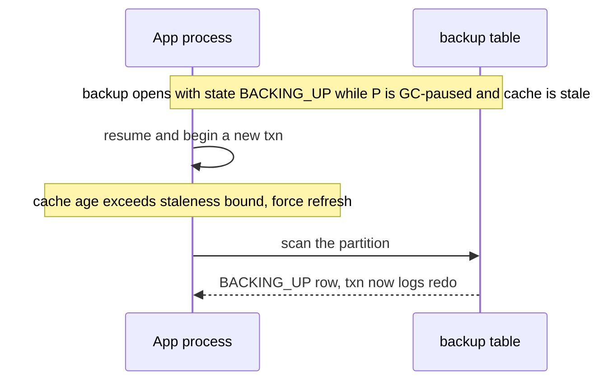

# CBRL — Draft Design: Enter/quit backup mode (embedded Core)

Status: **draft / design-only**.

Turns per-transaction redo logging on/off across every **app process** (each embedding ScalarDB
Core), so a point-in-time backup captures a transactionally-consistent set of redo. Embedded Core
can't push a flag to every process, so the flag lives in a coordinator-DB table that each process
reads with a local cache.

## Table: `<coordinator-ns>.backup`
One row per backup. The **partition key is a fixed constant** so every backup row lives in one
partition, and the **`label` is the clustering key**. That lets the daemon list all backups with a
**single-partition scan** (by partition key) — an ordinary, universally-supported scan, not a
cross-partition one — and returns them sorted by label. Created alongside `coordinator.state`;
timestamps are `BIGINT` epoch-millis, `label`/`state` are `TEXT`.

| column | type | notes |
|---|---|---|
| `id` | TEXT (PK) | fixed constant (e.g. `"backup"`) — co-locates every row in one partition |
| `label` | TEXT (CK) | backup label, usually its timestamp, e.g. `'2026-07-03T12:34:56'`; also the redo's `EntryGroup.backup_label` and the `CbrlRestore` argument |
| `state` | TEXT | lifecycle (below); an app process logs redo **iff** `state = BACKING_UP` |
| `created_at`, `updated_at` | BIGINT | backup started / last transition |
| `updated_by` | TEXT | operator id (observability) |

A fixed partition key means a single partition, but this is a tiny, low-write status table (writes
only on enter/quit/restore), so the usual hot-partition caveat doesn't apply. The coordinator
namespace is itself backed up, so a restore resurrects these rows — restore tooling must reset them.

## Lifecycle — `state` is the guard
Each backup is its own row (`id`, `label`); its `state` walks a small state machine. Each transition
is a `putIf` on the current `state`, so illegal moves (re-opening a live backup, restoring one that
isn't backed up) are rejected with no timestamp math.

Logging is ON only in `BACKING_UP`; `*_CANCELED` are terminal.

## Protocol

**Restore:** `putIf BACKED_UP to RESTORING`, run `CbrlRestore(label)`, `putIf RESTORING to RESTORED`.

## Keeping the backup complete
An **app process** is an application process embedding ScalarDB Core. Its scan is only periodic, so
three mechanisms guarantee no window-time commit goes unlogged:

- **Cache wait** (enter step above) — before trusting the consistency point, wait until every process
  has seen the flag and pre-flag transactions have drained.
- **`begin()` freshness** — `begin()` uses the cache but forces a synchronous scan if it is older than
  the staleness bound, so a process resuming from a stall can't start a transaction under a stale flag.
- **Transaction timeout** — a transaction self-aborts (retryable) if it runs longer than
  `transaction-timeout` (default `3 × check-interval` = 15s), bounding the "pre-flag txns drain" wait
  and killing any transaction frozen across the transition.

**Transaction timeout** in action — a long-running or GC-frozen transaction aborts at commit rather
than committing stale:

**`begin()` freshness** in action — a GC-paused app process that missed the flag:

## Config
- `scalar.db.consensus_commit.backup.check_interval_millis` — default **5000** (5–10s)
- `scalar.db.consensus_commit.backup.staleness_bound_millis` — default ~3× interval (oldest cache
  `begin()` accepts before forcing a fresh scan)
- `scalar.db.consensus_commit.transaction_timeout_millis` — default 3× interval = 15s (general
  transaction-lifetime bound)

## Maps to code
- `ConsensusCommitManager.backupLabel` → daemon-fed cache `{ backingUpLabels, lastReadAt }` (from a
  single-partition scan). Under the single-window assumption the scan returns at most one
  `BACKING_UP` row; if it ever returns more than one, the process logs an **error/warning** (the
  single-window invariant is broken — e.g. a misconfiguration or a premature concurrent-window
  attempt).
- `enableRedoLogging` → `putIfNotExists` a `BACKING_UP` row for the label; `disableRedoLogging` →
  `putIf → BACKED_UP`.
- `begin()` → read cache (fresh scan if stale) + stamp begin time in `TransactionContext`; commit
  aborts if `now - beginAt > transaction-timeout`.
- New `BackupModeDaemon` (periodic single-partition scan + one synchronous scan at startup) + a
  `backup` `TableMetadata`, wired into `ConsensusCommitAdmin`'s coordinator-table
  create/drop/truncate/exists/repair.
- **Cluster** pushes the flag (like pause) → needs none of this; the design is embedded-Core-only.

## Open questions
- **Concurrent windows** — the table already allows it (several `BACKING_UP` rows in the partition,
  and `begin()` caches the set). The remaining limiter is the write path: `EntryGroup.backup_label`
  stamps one label, so overlapping backups would need per-label logging. PoC assumes ≤1 live backup;
  until concurrent windows are supported, more than one `BACKING_UP` row is treated as an anomaly and
  logged (error/warning).
- **Table location** — the coordinator namespace (restore must reset the rows) vs a separate excluded
  system namespace.
