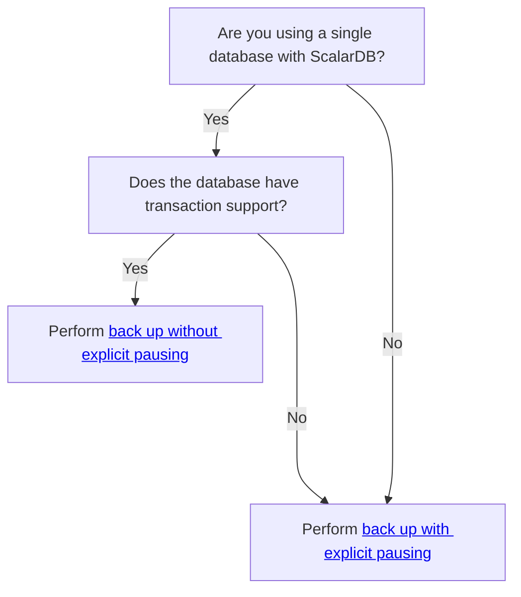

# How to Back Up and Restore Databases Used Through ScalarDB

Since ScalarDB provides transaction capabilities on top of non-transactional or transactional databases non-invasively, you need to take special care to back up and restore the databases in a transactionally consistent way.

This guide describes how to back up and restore the databases that ScalarDB supports.

## Create a backup

How you create a backup depends on which database you're using and whether or not you're using multiple databases. The following decision tree shows which approach you should take.

### Back up without explicit pausing

If you're using ScalarDB with a single database with support for transactions, you can create a backup of the database even while ScalarDB continues to accept transactions.


**Attention**

Before creating a backup, you should consider the safest way to create a transactionally consistent backup of your databases and understand any risks that are associated with the backup process.


{{ notice--warning | markdownify }}

One requirement for creating a backup in ScalarDB is that backups for all the ScalarDB-managed tables (including the Coordinator table) need to be transactionally consistent or automatically recoverable to a transactionally consistent state. That means that you need to create a consistent backup by dumping all tables in a single transaction.

How you create a transactionally consistent backup depends on the type of database that you're using. Select a database to see how to create a transactionally consistent backup for ScalarDB.


**Note**

The backup methods by database listed below are just examples of some of the databases that ScalarDB supports.


{{ notice--info | markdownify }}

  <button class="tablinks" onclick="openTab(event, 'Amazon_RDS_or_Azure_Database_for_MySQL_or_PostgreSQL1', 'tabset-1')" id="defaultOpen-1">Amazon RDS or Azure Database for MySQL or PostgreSQL</button>
  <button class="tablinks" onclick="openTab(event, 'MySQL1', 'tabset-1')">MySQL</button>
  <button class="tablinks" onclick="openTab(event, 'PostgreSQL1', 'tabset-1')">PostgreSQL</button>
  <button class="tablinks" onclick="openTab(event, 'SQLite1', 'tabset-1')">SQLite</button>
  <button class="tablinks" onclick="openTab(event, 'YugabyteDB_Managed1', 'tabset-1')">YugabyteDB Managed</button>

You can restore to any point within the backup retention period by using the automated backup feature.

Use the `mysqldump` command with the `--single-transaction` option.

Use the `pg_dump` command.

Use the `.backup` command with the `.timeout` command as specified in [Special commands to sqlite3 (dot-commands)](https://www.sqlite.org/cli.html#special_commands_to_sqlite3_dot_commands_)

For an example, see [BASH: SQLite3 .backup command](https://stackoverflow.com/questions/23164445/bash-sqlite3-backup-command).

Clusters are backed up automatically based on the backup policy, and these backups are retained for a specific duration. You can also perform on-demand backups. See [YugabyteDB Managed: Back up and restore clusters](https://docs.yugabyte.com/preview/yugabyte-cloud/cloud-clusters/backup-clusters/).

### Back up with explicit pausing

Another way to create a transactionally consistent backup is to create a backup while a cluster of ScalarDB instances does not have any outstanding transactions. Creating the backup depends on the following:

- If the underlying database has a point-in-time snapshot or backup feature, you can create a backup during the period when no outstanding transactions exist.
- If the underlying database has a point-in-time restore or recovery (PITR) feature, you can set a restore point to a time (preferably the mid-time) in the pause duration period when no outstanding transactions exist.


**Note**

When using a PITR feature, you should minimize the clock drifts between clients and servers by using clock synchronization, such as NTP. Otherwise, the time you get as the paused duration might be too different from the time in which the pause was actually conducted, which could restore the backup to a point where ongoing transactions exist.

In addition, you should pause for a sufficient amount of time (for example, five seconds) and use the mid-time of the paused duration as a restore point since clock synchronization cannot perfectly synchronize clocks between nodes.


{{ notice--info | markdownify }}

To make ScalarDB drain outstanding requests and stop accepting new requests so that a pause duration can be created, you should implement the [Scalar Admin](https://github.com/scalar-labs/scalar-admin) interface properly in your application that uses ScalarDB or use [ScalarDB Cluster (redirects to the Enterprise docs site)](https://scalardb.scalar-labs.com/docs/latest/scalardb-cluster/), which implements the Scalar Admin interface.

By using the [Scalar Admin client tool](https://github.com/scalar-labs/scalar-admin/tree/main/java#scalar-admin-client-tool), you can pause nodes, servers, or applications that implement the Scalar Admin interface without losing ongoing transactions.

How you create a transactionally consistent backup depends on the type of database that you're using. Select a database to see how to create a transactionally consistent backup for ScalarDB.


**Note**

The backup methods by database listed below are just examples of some of the databases that ScalarDB supports.


{{ notice--info | markdownify }}

  <button class="tablinks" onclick="openTab(event, 'Cassandra2', 'tabset-2')" id="defaultOpen-2">Cassandra</button>
  <button class="tablinks" onclick="openTab(event, 'Cosmos_DB_for_NoSQL2', 'tabset-2')">Cosmos DB for NoSQL</button>
  <button class="tablinks" onclick="openTab(event, 'DynamoDB2', 'tabset-2')">DynamoDB</button>
  <button class="tablinks" onclick="openTab(event, 'YugabyteDB_Managed2', 'tabset-2')">YugabyteDB Managed</button>

Cassandra has a built-in replication feature, so you do not always have to create a transactionally consistent backup. For example, if the replication factor is set to `3` and only the data of one of the nodes in a Cassandra cluster is lost, you won't need a transactionally consistent backup (snapshot) because the node can be recovered by using a normal, transactionally inconsistent backup (snapshot) and the repair feature.

However, if the quorum of cluster nodes loses their data, you will need a transactionally consistent backup (snapshot) to restore the cluster to a certain transactionally consistent point.

To create a transactionally consistent cluster-wide backup (snapshot), pause the application that is using ScalarDB or [ScalarDB Cluster (redirects to the Enterprise docs site)](https://scalardb.scalar-labs.com/docs/latest/scalardb-cluster/) and create backups (snapshots) of the nodes as described in [Back up with explicit pausing](#back-up-with-explicit-pausing) or stop the Cassandra cluster, take copies of all the data in the nodes, and start the cluster.

You must create a Cosmos DB for NoSQL account with a continuous backup policy that has the PITR feature enabled. After enabling the feature, backups are created continuously.

To specify a transactionally consistent restore point, pause your application that is using ScalarDB with Cosmos DB for NoSQL as described in [Back up with explicit pausing](#back-up-with-explicit-pausing).

You must enable the PITR feature for DynamoDB tables. If you're using [ScalarDB Schema Loader](schema-loader.md) to create schemas, the tool enables the PITR feature for tables by default.

To specify a transactionally consistent restore point, pause your application that is using ScalarDB with DynamoDB as described in [Back up with explicit pausing](#back-up-with-explicit-pausing).

Clusters are backed up automatically based on the backup policy, and these backups are retained for a specific duration. You can also perform on-demand backups. See [YugabyteDB Managed: Back up and restore clusters](https://docs.yugabyte.com/preview/yugabyte-cloud/cloud-clusters/backup-clusters/).

If you're using YugabyteDB with other databases, to ensure transactional consistency across databases, you'll need to pause the application using ScalarDB or [ScalarDB Cluster (redirects to the Enterprise docs site)](https://scalardb.scalar-labs.com/docs/latest/scalardb-cluster/) during the backup process, as described in [Back up with explicit pausing](#back-up-with-explicit-pausing).

## Restore a backup

How you restore a transactionally consistent backup depends on the type of database that you're using. Select a database to see how to create a transactionally consistent backup for ScalarDB.


**Note**

The restore methods by database listed below are just examples of some of the databases that ScalarDB supports.


{{ notice--info | markdownify }}

  <button class="tablinks" onclick="openTab(event, 'Amazon_RDS_or_Azure_Database_for_MySQL_or_PostgreSQL3', 'tabset-3')" id="defaultOpen-3">Amazon RDS or Azure Database for MySQL or PostgreSQL</button>
  <button class="tablinks" onclick="openTab(event, 'Cassandra3', 'tabset-3')">Cassandra</button>
  <button class="tablinks" onclick="openTab(event, 'Cosmos_DB_for_NoSQL3', 'tabset-3')">Cosmos DB for NoSQL</button>
  <button class="tablinks" onclick="openTab(event, 'DynamoDB3', 'tabset-3')">DynamoDB</button>
  <button class="tablinks" onclick="openTab(event, 'MySQL3', 'tabset-3')">MySQL</button>
  <button class="tablinks" onclick="openTab(event, 'PostgreSQL3', 'tabset-3')">PostgreSQL</button>
  <button class="tablinks" onclick="openTab(event, 'SQLite3', 'tabset-3')">SQLite</button>
  <button class="tablinks" onclick="openTab(event, 'YugabyteDB_Managed3', 'tabset-3')">YugabyteDB Managed</button>

You can restore to any point within the backup retention period by using the automated backup feature.

First, stop all the nodes of the Cassandra cluster. Then, clean the `data`, `commitlog`, and `hints` directories, and place the backups (snapshots) in each node.

After placing the backups (snapshots) in each node, start all the nodes of the Cassandra Cluster.

Follow the official Azure documentation for [restore an account by using Azure portal](https://docs.microsoft.com/en-us/azure/cosmos-db/restore-account-continuous-backup#restore-account-portal). After restoring a backup, [configure the default consistency level](https://learn.microsoft.com/en-us/azure/cosmos-db/nosql/how-to-manage-consistency#configure-the-default-consistency-level) of the restored databases to `STRONG`. In addition, you should use the mid-time of the paused duration as the restore point as previously explained.

ScalarDB implements the Cosmos DB adapter by using its stored procedures, which are installed when creating schemas by using ScalarDB Schema Loader. However, the PITR feature of Cosmos DB doesn't restore stored procedures. Because of this, you need to re-install the required stored procedures for all tables after restoration. You can do this by using ScalarDB Schema Loader with the `--repair-all` option. For details, see [Repair tables](schema-loader.md#repair-tables).

Follow the official AWS documentation for [restoring a DynamoDB table to a point in time](https://docs.aws.amazon.com/amazondynamodb/latest/developerguide/PointInTimeRecovery.Tutorial.html), but keep in mind that a table can only be restored with an alias. Because of this, you will need to restore the table with an alias, delete the original table, and rename the alias to the original name to restore the tables with the same name.

To do this procedure:

1. Create a backup.
  1. Select the mid-time of the paused duration as the restore point.
  2. Restore by using the PITR of table A to table B.
  3. Create a backup of the restored table B (assuming that the backup is named backup B).
  4. Remove table B.
2. Restore the backup.
  1. Remove table A.
  2. Create a table named A by using backup B.


**Note**

* You must do the steps mentioned above for each table because tables can only be restored one at a time.
* Configurations such as PITR and auto-scaling policies are reset to the default values for restored tables, so you must manually configure the required settings. For details, see the official AWS documentation for [How to restore DynamoDB tables with DynamoDB](https://docs.aws.amazon.com/amazondynamodb/latest/developerguide/CreateBackup.html#CreateBackup_HowItWorks-restore).


{{ notice--info | markdownify }}

If you used `mysqldump` to create the backup file, use the `mysql` command to restore the backup as specified in [Reloading SQL-Format Backups](https://dev.mysql.com/doc/mysql-backup-excerpt/8.0/en/reloading-sql-format-dumps.html).

If you used `pg_dump` to create the backup file, use the `psql` command to restore the backup as specified in [Restoring the Dump](https://www.postgresql.org/docs/current/backup-dump.html#BACKUP-DUMP-RESTORE).

Use the `.restore` command as specified in [Special commands to sqlite3 (dot-commands)](https://www.sqlite.org/cli.html#special_commands_to_sqlite3_dot_commands_).

You can restore from the scheduled or on-demand backup within the backup retention period. See [YugabyteDB Managed: Back up and restore clusters](https://docs.yugabyte.com/preview/yugabyte-cloud/cloud-clusters/backup-clusters/).

