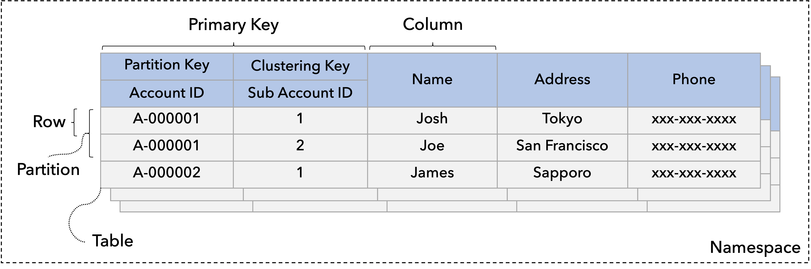

# Model Your Data

Data modeling (or in other words, designing your database schemas) is the process of conceptualizing and visualizing how data will be stored and used by identifying the patterns used to access data and the types of queries to be performed within business operations.

This page first explains the ScalarDB data model and then describes how to design your database schemas based on the data model.

## ScalarDB data model

ScalarDB's data model is an extended key-value model inspired by the Bigtable data model. It is similar to the relational model but differs in several ways, as described below. The data model is chosen to abstract various databases, such as relational databases, NoSQL databases, and NewSQL databases.

The following diagram shows an example of ScalarDB tables, each of which is a collection of records. This section first explains what objects, such as tables and records, ScalarDB defines and then describes how to locate the records.

### Objects in ScalarDB

The ScalarDB data model has several objects.

#### Namespace

A namespace is a collection of tables analogous to an SQL namespace or database.

#### Table

A table is a collection of partitions. A namespace most often contains one or more tables, each identified by a name.

#### Partition

A partition is a collection of records and a unit of distribution to nodes, whether logical or physical. Therefore, records within the same partition are placed in the same node. ScalarDB assumes multiple partitions are distributed by hashing.

#### Record / row

A record or row is a set of columns that is uniquely identifiable among all other records.

#### Column

A column is a fundamental data element and does not need to be broken down any further. Each record is composed of one or more columns. Each column has a data type. For details about the data type, refer to [Data-type mapping between ScalarDB and other databases](schema-loader.md#data-type-mapping-between-scalardb-and-other-databases).

#### Secondary index

A secondary index is a sorted copy of a column in a single base table. Each index entry is linked to a corresponding table partition. ScalarDB currently doesn't support multi-column indexes, so it can create indexes with only one column.

### How to locate records

This section discusses how to locate records from a table.

#### Primary key

A primary key uniquely identifies each record; no two records can have the same primary key. Therefore, you can locate a record by specifying a primary key. A primary key comprises a partition key and, optionally, a clustering key.

#### Partition key

A partition key uniquely identifies a partition. A partition key comprises a set of columns, which are called partition key columns. When you specify only a partition key, you can get a set of records that belong to the partition.

#### Clustering key

A clustering key uniquely identifies a record within a partition. It comprises a set of columns called clustering-key columns. When you want to specify a clustering key, you should specify a partition key for efficient lookups. When you specify a clustering key without a partition key, you end up scanning all the partitions. Scanning all the partitions is time consuming, especially when the amount of data is large, so only do so at your own discretion.

Records within a partition are assumed to be sorted by clustering-key columns, specified as a clustering order. Therefore, you can specify a part of clustering-key columns in the defined order to narrow down the results to be returned. 

#### Index key

An index key identifies records by looking up the key in indexes. An index key lookup spans all the partitions, so it is not necessarily efficient, especially if the selectivity of a lookup is not low.

## How to design your database schemas

You can design your database schemas similarly to the relational model, but there is a basic principle and are a few best practices to follow.

### Query-driven data modeling

In relational databases, data is organized in normalized tables with foreign keys used to reference related data in other tables. The queries that the application will make are structured by the tables, and the related data is queried as table joins.

Although ScalarDB supports join operations in ScalarDB SQL, data modeling should be more query-driven, like NoSQL databases. The data access patterns and application queries should determine the structure and organization of tables.

### Best practices

This section describes best practices for designing your database schemas.

#### Consider data distribution

Preferably, you should try to balance loads to partitions by properly selecting partition and clustering keys.

For example, in a banking application, if you choose an account ID as a partition key, you can perform any account operations for a specific account within the partition to which the account belongs. So, if you operate on different account IDs, you will access different partitions.

On the other hand, if you choose a branch ID as a partition key and an account ID as a clustering key, all the accesses to a branch's account IDs go to the same partition, causing an imbalance in loads and data sizes. In addition, you should choose a high-cardinality column as a partition key because creating a small number of large partitions also causes an imbalance in loads and data sizes.

#### Try to read a single partition

Because of the data model characteristics, single partition lookup is most efficient. If you need to issue a scan or select a request that requires multi-partition lookups or scans, which you can [enable with cross-partition scan](configurations.md#cross-partition-scan-configurations), do so at your own discretion and consider updating the schemas if possible. 

For example, in a banking application, if you choose email as a partition key and an account ID as a clustering key, and issue a query that specifies an account ID, the query will span all the partitions because it cannot identify the corresponding partition efficiently. In such a case, you should always look up the table with an account ID.

:::note

If you read multiple partitions on a relational database with proper indexes, your query might be efficient because the query is pushed down to the database. 

:::

#### Try to avoid using secondary indexes

Similarly to the above, if you need to issue a scan or select a request that uses a secondary index, the request will span all the partitions of a table. Therefore, you should try to avoid using secondary indexes. If you need to use a secondary index, use it through a low-selectivity query, which looks up a small portion.

As an alternative to secondary indexes, you can create another table that works as a clustered index of a base table. 

For example, assume there is a table with three columns: `table1(A, B, C)`, with the primary key `A`. Then, you can create a table like `index-table1(C, A, B)` with `C` as the primary key so that you can look up a single partition by specifying a value for `C`. This approach could speed up read queries but might create more load to write queries because you need to write to two tables by using ScalarDB transactions.

:::note

There are plans to have a table-based secondary-index feature in ScalarDB in the future.

:::

#### Consider data is assumed to be distributed by hashing

In the current ScalarDB data model, data is assumed to be distributed by hashing. Therefore, you can't perform range queries efficiently without a partition key.

If you want to issue range queries efficiently, you need to do so within a partition. However, if you follow this approach, you must specify a partition key. This can pose scalability issues as the range queries always go to the same partition, potentially overloading it. This limitation is not specific to ScalarDB but to databases where data is distributed by hashing for scalability.

:::note

If you run ScalarDB on a relational database with proper indexes, your range query might be efficient because the query is pushed down to the database. 

:::

