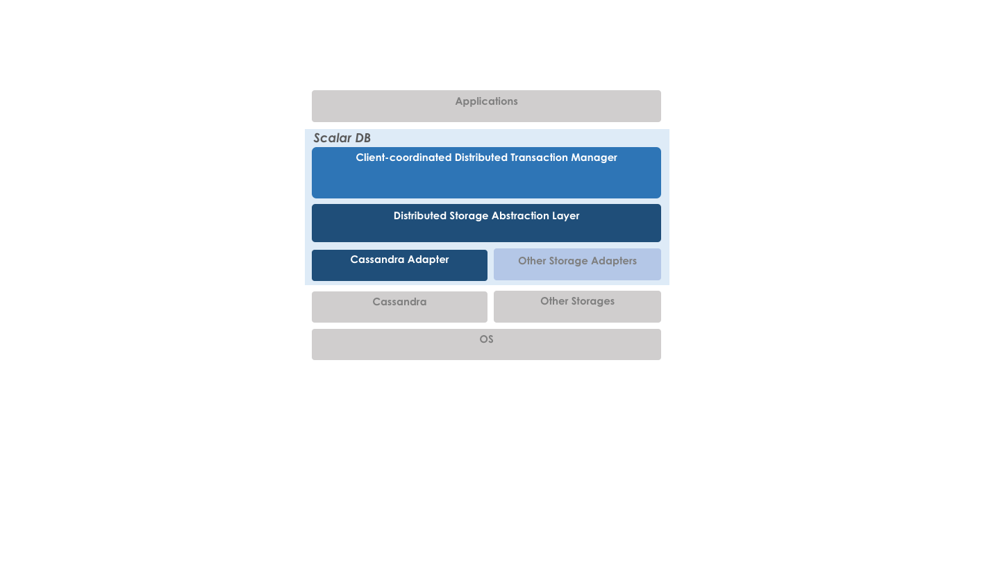
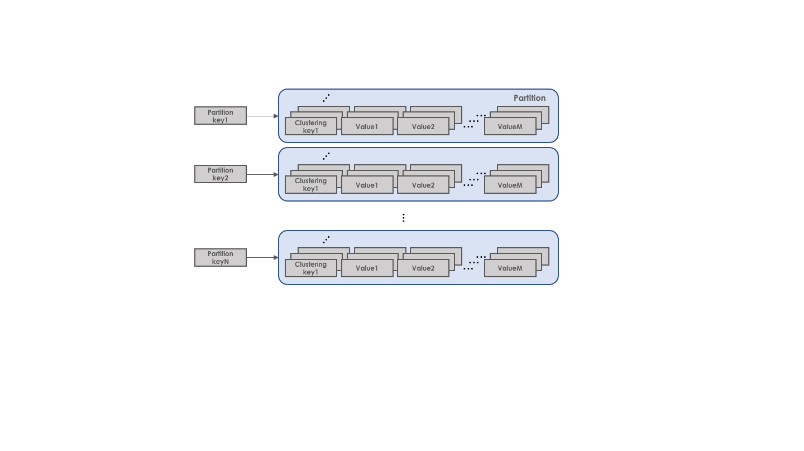

# ScalarDB design document

## Introduction

ScalarDB is a library that makes non-ACID databases/storages ACID-compliant.
This design document briefly explains its background, design, and implementation.

## Background and Objectives

Distributed storage is widely adopted in real-world applications and recent open-source distributed storages such as Cassandra and HBase have accelerated the trend. They are particularly used by large and sometimes mission-critical applications because of their high performance, high availability and high scalability. However, they often lack transaction capability, which is particularly important in mission-critical applications. Transaction capability can be added to HBase via third-party libraries, but they tend to sacrifice some availability property due to the master-slave architecture. Some companies have ended up creating yet another distributed transactional databases from scratch (such as CockroachDB and TiDB) to overcome such problem.

ScalarDB is a simple and practical solution to solve the above-mentioned problem in a different way. It provides a simple storage abstraction layer on the existing storage implementations and a storage-agnostic universal transaction manager on top of the storage abstraction[1]. So, it can fully utilize, not only battle-tested existing implementations, operational/management tools and good properties of storages but also the eco-system, the best practices, and the community which have grown for a long time.

## Design Goals

The primary design goal of ScalarDB is achieving ACID transaction capability without losing high availability, horizontal scalability, and strong consistency of underlying storage. The performance of the ScalarDB is highly dependent on the underlying storage performance and is usually slower than other scratch-built distributed databases since it adds a storage abstraction layer and storage-oblivious transaction layer, which makes various optimizations hard.

## High-level Architecture

ScalarDB is composed of universal transaction manager, storage abstraction, and storage adapters. Universal transaction manager and storage abstraction are storage-agnostic. On the other hand, storage adapters are storage-specific so there is an adapter for each storage implementation.

## Data Model

The data model of ScalarDB is a multi-dimensional map based on the key-value data model. A logical record is composed of partition-key, clustering-key and a set of columns. The column value is uniquely mapped by a primary key composed of partition-key, clustering-key and column-name as described in the following scheme.

(partition-key, clustering-key, column-name) -> column-value

### Physical Data Model

ScalarDB is a multi-dimensional map distributed to multiple nodes by key-based hash partitioning.
Records are assumed to be hash-partitioned by partition-key (even though an underlying implementation may support range partitioning).
Records with the same partition-key define a partition. A partition is clustered (sorted) by the clustering-key.
It is similar to Google BigTable [2] but it differs in clustering-key structure and partitioning scheme.

### Clustering order

As mentioned, records in ScalarDB are sorted by the clustering-key in a partition.
You can specify the default sort orders of the clustering-key, that's called clustering order, when you create tables.
If the clustering-key consists of multiple columns, you can specify clustering order for each column.

### Secondary index

In ScalarDB, you can basically scan a table only using columns that are part of the primary key.
Secondary Indexes in ScalarDB solve the need for querying columns that are not part of the primary key.
You can create a secondary index on a single column on a table.
Secondary indexes are used to scan a table using a column that is not normally queryable.

### Limitation of the data model

Since records in ScalarDB are assumed to be hash-partitioned, global range scan is not supported.
Range scan is only supported for clustering-key access within the same partition.

## Implementation

### Storage

As of writing this, ScalarDB supports Cassandra and Cosmos DB as a storage implementation. More correctly for Cassandra, it supports Cassandra java-driver API. Thus Cassandra java-driver compatible storage systems, such as ScyllaDB, can potentially also be used. The storage abstraction assumes the following features/properties, which most recent distributed storages have:

- Atomic CRUD operations (each single-record operation needs to be atomic)
- Sequential consistency support
- Atomic/Linearizable conditional mutation (Create/Update/Delete)
- Ability to include user-defined meta-data for each record

Please see the javadoc for more details and usage.

### Transaction

ScalarDB executes transactions in a fully client-coordinated way so that it can do master-less transactions, which achieves almost linear scalability and high availability (especially when it is integrated with scalable and highly available storages).
It basically follows Cherry Garcia protocol proposed in [3]. More specifically, ScalarDB achieves scalable distributed transaction by utilizing atomic conditional mutation for managing transaction state and storing WAL (Write-Ahead-Logging) records in distributed fashion in each record by using meta-data ability.
It also has some similarity to paxos-commit [4].

ScalarDB supports Snapshot Isolation (SI) and Serializable as Isolation levels.
SI in ScalarDB is a variant of SI defined in ANSI and similar to RCSI (Read Committed Snapshot Isolation) used in SQL Server. It doesn't create a global snapshot so Read Skew could happen in certain cases in addition to the usual SI anomalies such as Write Skew anomaly and Read-Only Transaction anomaly. Serializable is achieved with two strategies; Extra-write and Extra-read, which both avoid anti-dependency that is the root cause of the anomalies in SI. Extra-write basically converts reads into writes to remove anti-dependencies, and Extra-read re-reads its read set in the commit phase to actually check if there is an anti-dependency.
Please see the javadoc for more details and usage.

## References

- [1] D. B. Lomet, A. Fekete, G. Weikum, and M. J. Zwilling.  Unbundling Transaction Services in the Cloud. In CIDR, Jan. 2009.
- [2] Fay Chang , Jeffrey Dean , Sanjay Ghemawat , Wilson C. Hsieh , Deborah A. Wallach , Mike Burrows , Tushar Chandra , Andrew Fikes , Robert E. Gruber, Bigtable: A Distributed Storage System for Structured Data, ACM Transactions on Computer Systems (TOCS), v.26 n.2, p.1-26, June 2008.
- [3] A. Dey, A. Fekete, U. Röhm, "Scalable Distributed Transactions across Heterogeneous Stores", IEEE 31th International Conference on Data Engineering (ICDE), 2015.
- [4] Jim Gray , Leslie Lamport, Consensus on transaction commit, ACM Transactions on Database Systems (TODS), v.31 n.1, p.133-160, March 2006.

## Further reading

- [Making Cassandra more capable, faster, and more reliable](https://speakerdeck.com/scalar/making-cassandra-more-capable-faster-and-more-reliable-at-apachecon-at-home-2020) at ApacheCon@Home 2020
- [Scalar DB: A library that makes non-ACID databases ACID-compliant](https://speakerdeck.com/scalar/scalar-db-a-library-that-makes-non-acid-databases-acid-compliant) at Database Lounge Tokyo #6 2020
- [Transaction Management on Cassandra](https://speakerdeck.com/scalar/transaction-management-on-cassandra) at Next Generation Cassandra Conference / ApacheCon NA 2019
