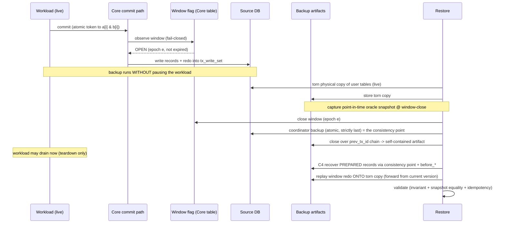
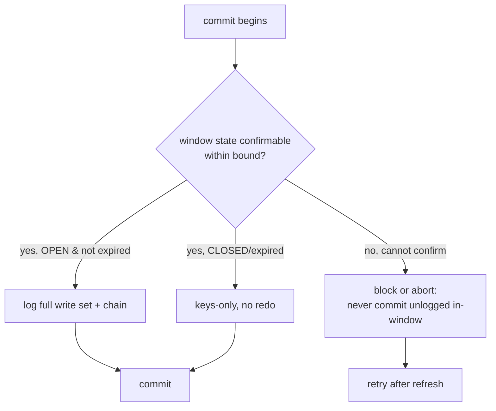

# feat: Faithful CBRL backup/restore end-to-end test (full machinery)

## Summary

Build an end-to-end test that actually exercises the CBRL guarantee — **non-pausing, point-in-time, transactionally-consistent** backup and restore — instead of the current IT, which quiesces before the coordinator backup, full-rebuilds from the whole log, and only checks internal consistency. Reaching a faithful test requires building the machinery the PoC plan deferred to §10: a durable **backup-window gate** (fail-closed, TTL), window-scoped redo logging, a **self-contained consistency point** (C3), **PREPARED-record recovery** (C4), and **genuine windowed repair** of a torn physical copy. The deliverable is the test *and* the production-shaped machinery it needs, plus a layered validation strategy that proves the restored tables are both internally consistent and equal to the source as of the consistency point.

Terminology: the **consistency point** is the instant the coordinator backup captures — it fixes exactly the set of transactions committed by then, which is what restore reconstructs to.

This is **Full-faithful** (Option 1 from planning): the window flag is a real durable, observable, fail-closed switch, not an approximated replay-range boundary.

---

## Problem Frame

CBRL backs up a primary ScalarDB database with no backup site by logging each commit's write set into the coordinator's `tx_write_set` during a backup window, then replaying onto the primary on restore. Its defining properties: the backup runs **without pausing** the database, the restored image is a **transactionally-consistent point-in-time** snapshot, and replay **repairs a torn physical copy** rather than rebuilding from full history.

The replay core (`cbrl/RecordShuffler`, `RecordApplier`, the `CbrlReplayException` fork check, chain model) exists and is unit/property-tested (§6.2). The current integration test (`CbrlBackupRestoreIntegrationTest`) does **not** test CBRL: it stops the workload before the coordinator backup (violating non-pausing), discards the torn copy and rebuilds from the full log (no repair, no window), re-queries the live coordinator at restore (the backup is not self-contained), and asserts only a cross-table invariant (cannot catch a symmetric replay error). This plan replaces it with a faithful E2E test and builds the deferred machinery that makes the test meaningful.

---

## Requirements

- **R1 — Non-pausing backup.** The workload commits continuously throughout the torn-copy backup *and* the coordinator backup; nothing quiesces the database before or during backup.
- **R2 — Window-scoped logging via a real gate.** Full-write-set redo logging (and logical-delete mode) is controlled by a durable, runtime-readable backup-window flag that every commit path observes; logging happens only while the window is open. The flag carries a TTL/epoch so a crashed backup can't pin the window open. *(origin §7 "backup-mode flag" TODO; concern #2)*
- **R3 — Fail-closed window visibility.** A commit path that cannot confirm the current window state must not commit in a chain-breaking way (it blocks or aborts rather than committing unlogged). *(origin concern #2 — "the table is necessary, not sufficient")*
- **R4 — Self-contained consistency point (C3).** The coordinator backup is atomic, strictly last, group-atomic (all `child_ids` of a row in or out), and **closed over the `prev_tx_id` chain at backup time** so restore never re-queries the live source. *(origin §7 C3; concern #8)*
- **R5 — PREPARED-record recovery (C4).** Records left PREPARED in the torn backup image are resolved to a clean committed state via the consistency point + `before_*` images **before** chain replay anchors. *(origin §7 C4)*
- **R6 — Windowed repair, not rebuild.** Restore loads the torn physical copy and replays only the window's redo *onto* it (replay-forward from each record's current version), reaching the consistency-point state. *(origin §6.1 intent)*
- **R7 — Restored tables are transactionally consistent.** No transaction is split across the consistency point: for every key, the two tables agree on presence and on a shared per-transaction token.
- **R8 — Restored tables equal the source as of the consistency point.** The restored image equals a consistent point-in-time snapshot of the source captured at the consistency point — catching symmetric replay errors that consistency alone cannot.
- **R9 — Validation has teeth.** A negative control proves the consistency and point-in-time checks detect a torn / wrong image.
- **R10 — Idempotent restore.** Running the restore twice yields the same image.

---

## Key Technical Decisions

- **KTD1 — Window flag lives in a Core table, consulted fail-closed in the commit path.** A dedicated coordinator-side table (`{ window_id, epoch, opened_at, expires_at }`) is the durable source of truth; the commit path observes it through a gate that fails closed. Rationale: this is a Core-level spike with no Cluster; a Core table is the simplest durable, every-process-visible store. Cluster-push distribution (origin §7 "where it lives — TBD") is deferred. *(see origin: CBRL-RESTORE-POC-PLAN.md §7)*
- **KTD2 — One flag gates both redo logging and logical-delete mode.** They must flip together (origin concern #2). The existing `CommitHandler.redoLoggingEnabled` `AtomicBoolean` becomes a cache of the durable flag, revalidated against TTL/epoch, not an independent switch.
- **KTD3 — The coordinator backup is closed at backup time, stored as a portable artifact.** The coordinator scan is followed by `prev_tx_id` transitive closure *during backup* (source still available), producing a self-contained set of committed rows. Restore consumes only that artifact — fixes the current "re-query live coordinator at restore" flaw.
- **KTD4 — Repair replays forward from each record's current version.** `RestoredRecordReader` reads the C4-recovered torn copy; the §5 cursor walks the chain *from* that version, applying only the window's tail. Mirrors SSR's `rollforward`/`rollback` via `CommitMutationComposer`/`RollbackMutationComposer` (origin §7 C4). No truncate-and-rebuild.
- **KTD5 — Point-in-time oracle = consistent snapshot captured at window-close.** Window-close is the controlled instant that defines the consistency point; the oracle is a transactional consistent read of the source taken at window-close, against which the restored image is compared exactly. Alignment of the snapshot and the coordinator backup is the key risk (see Risks).
- **KTD6 — Workload probes consistency with a shared token written to both tables atomically.** Each transaction writes the same token to `table_a[i]` and `table_b[i]` (or deletes both); any split transaction shows mismatched tokens/presence. This is the consistency oracle's substrate.
- **KTD7 — Validation is layered, not single-assertion.** Consistency invariant (R7) + point-in-time equality (R8) + idempotency (R10) + negative control (R9). No single check is sufficient; together they cover consistency *and* correctness. (Copy-consistency / C3 is enforced by the restore failing loud on a non-closed copy, not a validation layer — see Validation Strategy.)

---

## High-Level Technical Design

End-to-end flow (sequence), showing the backup running under live load and restore reaching the consistency-point state:



Fail-closed gate decision in the commit path (R3):



---

## Output Structure

New machinery groups under a `cbrl/` backup subpackage; the replay core stays where it is.

```
core/src/main/java/com/scalar/db/transaction/consensuscommit/cbrl/
  window/
    BackupWindow.java            // { windowId, epoch, openedAt, expiresAt } + open/expired logic
    BackupWindowStore.java       // durable read/write against a Core table
    BackupWindowGate.java        // fail-closed observe used by the commit path
  backup/
    CoordinatorBackup.java       // self-contained, chain-closed committed-row set (artifact) = the consistency point
    ConsistencyPointCapturer.java// scan + group-atomic + transitive prev_tx_id closure at backup time
    TornBackup.java              // captured physical copy handle + PREPARED-recovery entry point
    PreparedRecoverer.java       // C4: resolve PREPARED records via before_* + the consistency point
    WindowedRepairer.java        // load torn copy -> replay window redo forward -> write back
    PointInTimeSnapshot.java     // consistent state-at-consistency-point oracle capture

core/src/integration-test/java/com/scalar/db/transaction/consensuscommit/cbrl/
  CbrlFaithfulE2ETest.java       // the faithful E2E (replaces the current consistency-only IT)
  CbrlConsistencyValidator.java  // layered validation harness (invariant + snapshot + idempotency)
```

---

## Implementation Units

### Phase A — Window gate & scoped logging

### U1. Durable backup-window flag and fail-closed gate

**Goal:** A durable, runtime-readable "is the CBRL window open?" switch that every commit path observes fail-closed, with TTL/epoch.
**Requirements:** R2, R3.
**Dependencies:** none.
**Files:** `core/src/main/java/com/scalar/db/transaction/consensuscommit/cbrl/window/BackupWindow.java`, `.../window/BackupWindowStore.java`, `.../window/BackupWindowGate.java`; modify `core/src/main/java/com/scalar/db/transaction/consensuscommit/CommitHandler.java` (consult gate), `.../ConsensusCommitManager.java` (open/close API replacing the PoC `enable/disableRedoLogging`); test `core/src/test/java/com/scalar/db/transaction/consensuscommit/cbrl/window/BackupWindowGateTest.java`.
**Approach:** Store `{ windowId, epoch, openedAt, expiresAt }` in a coordinator-side table. The gate reads it with a short cache + revalidation; a window past `expiresAt` is treated closed (TTL). Fail-closed: if the gate cannot confirm current state within a bound, the commit blocks/aborts rather than committing unlogged (R3). One flag gates both redo logging and logical-delete mode (KTD2).
**Patterns to follow:** the existing `CommitHandler.redoLoggingEnabled` `AtomicBoolean` becomes the gate's cache; `BeforePreparationHook` is the existing commit-path seam to consult the gate.
**Test scenarios:**
- Window OPEN, not expired → gate reports open. Happy path.
- Window CLOSED → gate reports closed.
- Window past `expiresAt` → treated closed even if not explicitly closed (TTL). Edge.
- Epoch advanced since cache → gate revalidates, uses new epoch. Edge.
- Gate cannot read the flag within the bound → reports "unconfirmable", commit path blocks/aborts (R3). Error path.
**Verification:** Unit tests drive each gate state; an unconfirmable-flag case proves fail-closed (no silent open).

### U2. Window-scoped redo logging

**Goal:** Redo logging (full write set + chain) happens only while the window is open, driven by U1's gate.
**Requirements:** R2.
**Dependencies:** U1.
**Files:** modify `core/src/main/java/com/scalar/db/transaction/consensuscommit/CommitHandler.java`, `.../CommitHandlerWithGroupCommit.java`, `.../WriteSetEncoder.java` (already supports `includeColumns`); test `core/src/test/java/com/scalar/db/transaction/consensuscommit/cbrl/window/WindowScopedLoggingTest.java`.
**Approach:** Replace the static `redoLoggingEnabled.get()` reads at the encode call sites with a gate consult. Commits outside the window log keys-only (master behavior); commits inside log the full write set. The transition must be clean at window open/close boundaries.
**Test scenarios:**
- Commit while open → `tx_write_set` carries columns + `prev_tx_id`/`tx_version`. Covers R2.
- Commit while closed → keys-only, byte-identical to master.
- Commit straddling a close (window closes mid-flight) → records the boundary behavior deterministically (logged iff window was open at the gated point).
**Verification:** Decode `tx_write_set` for in-window vs out-of-window commits and assert full vs keys-only.

### Phase B — Non-pausing backup

### U3. Live torn physical backup of user tables

**Goal:** Copy the user tables while the workload commits, producing a genuinely torn image.
**Requirements:** R1.
**Dependencies:** U1 (window open during copy).
**Files:** `core/src/main/java/com/scalar/db/transaction/consensuscommit/cbrl/backup/TornBackup.java`; exercised from the E2E test.
**Approach:** Storage-level scan→copy of the user tables into a backup namespace **while the workload runs** (mirrors the current `copyTable`, but kept as the genuine base for repair rather than discarded). Captures ConsensusCommit metadata columns so PREPARED records are recoverable in U6.
**Test scenarios:** `Test expectation: none — exercised end-to-end in U10; no standalone behavior beyond a storage copy.`
**Verification:** After a live copy, the backup namespace contains a mix that includes at least one PREPARED record under load (feeds U6).

### U4. Self-contained consistency point (C3)

**Goal:** Capture the coordinator state as an atomic, group-atomic, chain-closed artifact — self-contained, no live-source re-query at restore.
**Requirements:** R4.
**Dependencies:** U1.
**Files:** `core/src/main/java/com/scalar/db/transaction/consensuscommit/cbrl/backup/CoordinatorBackup.java`, `.../backup/ConsistencyPointCapturer.java`; test `core/src/test/java/com/scalar/db/transaction/consensuscommit/cbrl/backup/ConsistencyPointCapturerTest.java`.
**Approach:** Scan the coordinator at window-close; keep only COMMITTED rows; treat each row's `EntryGroup` set all-or-nothing (group-atomic). Then transitively close over `prev_tx_id` **at backup time** (source available) by fetching any referenced predecessor not yet in the set, until closed. The result is a `CoordinatorBackup` artifact consumed by restore — restore never touches the live coordinator. *(origin §7 C3, Q1)*
**Test scenarios:**
- A committed op referencing a predecessor missed by the initial scan → closure fetches it; resulting set is chain-closed. Covers R4.
- A row with multiple `child_ids` → all-or-nothing inclusion (group-atomic). Edge.
- Non-COMMITTED (PREPARED/ABORTED) rows → excluded. Edge.
- Restore run against only the artifact (live coordinator deleted/unavailable) → succeeds. Covers R4 self-containment.
**Verification:** Build a backup with a deliberately incomplete scan; assert closure yields a set with no dangling `prev_tx_id`, and that a restore using only the artifact replays without `CbrlReplayException`.

### U5. Point-in-time oracle snapshot at window-close

**Goal:** Capture a consistent state-at-consistency-point snapshot of the source to serve as the correctness oracle.
**Requirements:** R8.
**Dependencies:** U1.
**Files:** `core/src/main/java/com/scalar/db/transaction/consensuscommit/cbrl/backup/PointInTimeSnapshot.java`; exercised from the E2E test and validated in U8.
**Approach:** At window-close (the controlled instant that defines the consistency point), read the source under a single consistent transactional scan to capture each key's value as of that point. Stored as the oracle. Alignment with the coordinator backup is the central risk (see Risks) — window-close is the synchronization point both the coordinator backup and the snapshot key off.
**Test scenarios:** `Test expectation: none directly — its correctness is asserted transitively in U8 (restored image equals this snapshot) and stressed by U9.`
**Verification:** The snapshot is internally consistent (passes the same cross-table invariant as the restored image).

### Phase C — Restore

### U6. PREPARED-record recovery (C4)

**Goal:** Resolve PREPARED records in the torn backup to a clean committed state before replay anchors.
**Requirements:** R5.
**Dependencies:** U3, U4.
**Files:** `core/src/main/java/com/scalar/db/transaction/consensuscommit/cbrl/backup/PreparedRecoverer.java`; implement `RestoredRecordReader` over the recovered image; test `core/src/test/java/com/scalar/db/transaction/consensuscommit/cbrl/backup/PreparedRecovererTest.java`.
**Approach:** For each PREPARED record in the torn copy, consult the coordinator backup: if the writing tx is COMMITTED there, roll forward (apply after-image); else roll back to the `before_*` image. Mirrors SSR `rollforward`/`rollback` via `CommitMutationComposer`/`RollbackMutationComposer` (origin §7 C4). The recovered image is what `RestoredRecordReader` exposes to repair (U7).
**Execution note:** Start with a failing test that loads a torn copy containing a PREPARED record and asserts the recovered state.
**Test scenarios:**
- PREPARED record whose tx is COMMITTED in the coordinator backup → rolled forward to after-image. Covers R5.
- PREPARED record whose tx is absent/aborted in the coordinator backup → rolled back to `before_*`. Covers R5.
- PREPARED delete → resolved to absent or restored per the coordinator backup. Edge.
- Torn copy with no PREPARED records → recovery is a no-op. Edge.
- Backup image missing `before_*` for a PREPARED record → fail loud (confirms the assumption in origin §7 C4). Error path.
**Verification:** Recovered image has no PREPARED records and matches the committed decision in the coordinator backup.

### U7. Windowed torn-copy repair

**Goal:** Replay the window's redo *onto* the recovered torn copy, reaching the consistency-point state — genuine repair, not rebuild.
**Requirements:** R6.
**Dependencies:** U4, U6, existing replay core.
**Files:** `core/src/main/java/com/scalar/db/transaction/consensuscommit/cbrl/backup/WindowedRepairer.java`; test `core/src/test/java/com/scalar/db/transaction/consensuscommit/cbrl/backup/WindowedRepairerTest.java`.
**Approach:** Explode the coordinator backup's window redo into `RedoOp`s; `RestoredRecordReader` returns each key's recovered current version; the §5 cursor walks the chain *forward from that version*, applying only the tail the torn copy is missing. Write back transactionally so restored records carry proper metadata. No truncate-and-rebuild.
**Test scenarios:**
- Torn copy at version V; window redo carries V→V+1→V+2 → repaired record is V+2. Covers R6.
- Key deleted within the window → repaired record absent. Edge.
- Key re-inserted after a delete within the window → repaired record present with the re-insert. Edge (delete→re-insert root).
- Torn copy already current for a key (no window ops) → unchanged. Edge.
- Repaired record carries readable ConsensusCommit metadata (transactional read works). Integration.
**Verification:** Per-key repaired state equals the sequential expectation from the recovered base + window redo.

### Phase D — Validation & the E2E test

### U8. Layered consistency + correctness validation harness

**Goal:** The validation that proves the restored tables are consistent *and* correct as of the consistency point.
**Requirements:** R7, R8, R10.
**Dependencies:** U5, U7.
**Files:** `core/src/integration-test/java/com/scalar/db/transaction/consensuscommit/cbrl/CbrlConsistencyValidator.java`; exercised by U9 and U10.
**Approach:** Three layers (see Validation Strategy section):
1. **Consistency invariant (R7):** every key — `a[i]` present ⟺ `b[i]` present, and `a[i].token == b[i].token`.
2. **Point-in-time equality (R8):** restored image equals the U5 snapshot, per key (presence + all columns).
3. **Idempotency (R10):** a second restore from the same artifacts yields the same image.
**Test scenarios:**
- A fully consistent, point-aligned restored image → zero violations across all three layers. Covers R7, R8, R10.
- Re-run restore → identical image (idempotency). Covers R10.
**Verification:** All three layers report clean on a correct restore; each layer is independently invocable (so U9 can target each). Copy-consistency (C3/R4) is **not** a layer here, but not because the restore fails loud on a bad copy — replay is SSR-tolerant and silently skips a dangling/below-base `prev_tx_id` (no throw; §6.2 P3). A non-closed copy that loses data instead surfaces as a **point-in-time-equality (layer 2) mismatch** against the snapshot, so a separate copy-consistency layer detects nothing layer 2 doesn't. The one structural anomaly replay *does* reject is a fork (two ops sharing a `prev_tx_id`, which serializable commit cannot produce → `CbrlReplayException`), and that check is unit-tested at §6.2.

### U9. Negative control — validation has teeth

**Goal:** Prove each validation layer detects a torn / wrong / non-idempotent image.
**Requirements:** R9.
**Dependencies:** U8.
**Files:** `core/src/integration-test/java/com/scalar/db/transaction/consensuscommit/cbrl/CbrlFaithfulE2ETest.java` (negative-control test methods).
**Approach:** Inject specific defects and assert the corresponding layer flags them.
**Test scenarios:**
- Token mismatch (`a[k].token != b[k].token`) → invariant layer flags key k. Covers R9/R7.
- Presence mismatch (`a[k]` present, `b[k]` absent) → invariant layer flags key k. Covers R9/R7.
- Restored value off by one version vs the snapshot (symmetric replay error) → point-in-time layer flags it, even though the invariant passes. Covers R9/R8 — the case the current IT cannot catch.

The dropped-mid-chain-op case (a non-closed copy) is **not** an E2E negative control: it makes the restore throw, and its teeth are already proven at the unit level by §6.2 P3.
**Verification:** Each injected defect is caught by exactly the intended layer; the symmetric-replay case specifically passes the invariant but fails point-in-time.

### U10. The faithful E2E test

**Goal:** Orchestrate the full non-pausing backup → consistency point → C4 → windowed repair → validate flow against Postgres.
**Requirements:** R1–R10.
**Dependencies:** U1–U9.
**Files:** `core/src/integration-test/java/com/scalar/db/transaction/consensuscommit/cbrl/CbrlFaithfulE2ETest.java`; remove/replace the current `CbrlBackupRestoreIntegrationTest.java`.
**Approach:** Workload writes a shared token to `table_a[i]` and `table_b[i]` atomically (KTD6). Flow: open window → start workload → live torn copy (U3) → capture oracle snapshot + close window + take the self-contained coordinator backup (U4/U5) at window-close → (workload may drain, teardown only) → C4 recovery (U6) → windowed repair (U7) → validate (U8). The workload **never pauses before or during backup** (R1).
**Execution note:** Build the acceptance flow as the failing test first; it goes green only when U1–U8 land.
**Test scenarios:**
- Full flow under live load → all four validation layers clean; non-trivial number of keys present. Covers R1, R6, R7, R8, R10.
- Assert the workload was still committing during the coordinator backup (e.g., commit count advances across the backup window) → proves non-pausing. Covers R1.
- A transaction committed after window-close is **absent** from the restored image. Covers R8 (point-in-time boundary).
- Re-run restore from the same artifacts → identical image. Covers R10.
**Verification:** Reliable across repeated runs (loop the IT to rule out flakiness); the non-pausing assertion and the post-window-close exclusion assertion both hold.

---

## Validation Strategy (how we prove the restored tables are consistent)

Restored-table correctness is validated in **three independent layers**, because no single check is sufficient — consistency without correctness misses symmetric replay errors, and correctness without a teeth-check can silently pass on a broken oracle.

1. **Cross-table atomic invariant (consistency, R7).** The workload writes the same per-transaction `token` to `table_a[i]` and `table_b[i]` in one transaction, or deletes both. Therefore any transactionally-consistent image has, for every key, matching presence and equal tokens. A transaction split across the consistency point (one write in, one out) produces a mismatch. This catches torn backups and half-applied transactions. **Limitation:** it cannot catch a replay error that mis-handles both tables symmetrically (both end at the wrong-but-equal token) — which is why layer 2 exists.
2. **Point-in-time equality to the snapshot (correctness, R8).** At window-close (U5) we capture a consistent snapshot of the source as of the consistency point. The restored image must equal it per key (presence + every column). This catches symmetric replay errors and broken repair — e.g., a dropped DELETE leaves the restored record one version stale, which equals neither the snapshot. It also enforces the point-in-time boundary: a transaction committed *after* the consistency point must be absent from the restore.
3. **Idempotency (R10).** Restoring twice from the same artifacts yields the same image — guards against order- or state-dependent replay/repair bugs.

**Not a layer — copy-consistency (C3/R4).** An earlier draft had a "chain-integrity" layer asserting the replay raises no `CbrlReplayException`. It was dropped because replay is **SSR-tolerant**: a dangling `prev_tx_id` is *skipped, not thrown* (§6.2 P3), so on any restore — successful or from an incomplete copy — there is nothing for this layer to assert. A bad copy's observable effect (lost/incorrect data) instead shows up as a point-in-time-equality (layer 2) mismatch. The only throw is a fork (two ops sharing a `prev_tx_id`, which serializable commit cannot produce); that fork check is unit-tested at §6.2 and belongs at the core level, not the E2E.

**Teeth (R9, U9).** Each layer is paired with a negative control that injects the specific defect it should catch (token mismatch, presence mismatch, off-by-one-version vs snapshot) and asserts the layer flags it. The symmetric-replay negative control specifically demonstrates layer 1 passing while layer 2 fails — proving the layers are non-redundant.

**The hard alignment (carried as a risk):** layer 2's snapshot and the coordinator backup must reflect the *same* set of committed transactions. Window-close is the synchronization instant both key off; achieving exact alignment under live load is the C3 problem and the highest-risk part of this plan (see Risks).

---

## Scope Boundaries

**In scope:** the durable window gate (fail-closed, TTL), window-scoped logging, live torn backup, self-contained consistency point (C3), PREPARED-record recovery (C4), windowed repair, point-in-time oracle, the layered validation (consistency + point-in-time + idempotency), and the faithful E2E test — for **single / normal (non-group-commit)** transactions on JDBC/Postgres.

### Deferred to Follow-Up Work
- **Group-commit restore.** The coordinator backup/replay handle a single `EntryGroup` per row; group-commit child-id exploding is a follow-up (the E2E workload uses non-group-commit).
- **Cluster-push flag distribution.** KTD1 uses a Core table; pushing the window flag like pause from Cluster is deferred (origin §7 "where it lives — TBD").
- **Writing replayed state to a real distributed primary** (origin §10) — the test restores into a ScalarDB namespace, not a production primary mid-recovery.

### Outside this effort
- **Two-phase commit.** `TwoPhaseConsensusCommit` logs no write set (origin "Known gap"); 2PC backup/restore is a separate problem, not a fidelity dial here.
- **Performance / overhead** of windowed logging — measured separately (§6.3), not part of this test.

---

## Risks & Dependencies

- **R-risk-1 — Snapshot/coordinator-backup alignment (highest).** The point-in-time oracle (U5) and the coordinator backup (U4) must reflect the same committed-tx set. Misalignment makes layer-2 equality flaky. *Mitigation:* both key strictly off window-close; consider briefly pausing commits *for the oracle read only* (the backup stays non-pausing — only the test's measurement synchronizes). A non-closed copy can't pass silently regardless — replay tolerates it (no throw), but the resulting data loss surfaces as a point-in-time-equality (layer 2) mismatch against the snapshot. This is the part most likely to need an implementation-time design call.
- **R-risk-2 — Fail-closed visibility is hard to test deterministically (origin concern #2).** Simulating "a node that can't confirm the window" (GC pause / partition) in an IT is non-trivial. *Mitigation:* unit-test the gate's unconfirmable path directly (U1) rather than relying on the E2E to induce it.
- **R-risk-3 — C4 recovery with foreign tx-ids.** The torn copy's PREPARED records reference source tx-ids that must resolve against the coordinator-backup artifact, not the live coordinator. *Mitigation:* drive recovery purely from the self-contained coordinator backup (U4) + `before_*`.
- **R-risk-4 — TTL/epoch semantics** (window expiry mid-backup) could orphan a backup. *Mitigation:* explicit expiry handling in U1 + a test for "window expired mid-window".
- **Dependency:** existing replay core (`cbrl/RecordApplier` et al.) and `WriteSetEncoder` `includeColumns` path; PostgreSQL for the IT.

---

## Open Questions (resolve during implementation)

- Exact window-flag table schema and whether a window **epoch/id** is needed to detect stale caches (lean yes).
- The precise snapshot/coordinator-backup alignment mechanism (R-risk-1) — pausing-commits-for-oracle-read vs. a snapshot-isolation read that the coordinator backup is defined to match.
- Whether to reuse `BeforePreparationHook` for the gate consult or add a dedicated commit-path hook.
- Whether `before_*` images are reliably present in a storage-level torn copy for every PREPARED record (origin §7 C4 asks to confirm).
- Whether the current `CbrlBackupRestoreIntegrationTest` is deleted or kept as a narrower replay-core IT.

---

## Sources & Research

- `CBRL-RESTORE-POC-PLAN.md` — origin: §6.1 (E2E intent), §7 (D1/Q1/C3/C4 + backup-mode flag TODO), §10 (out of scope), §4–5 (replay core/primitive).
- This session's first-hand reading: `WriteSetEncoder` (`includeColumns`/chain), `CommitHandler`/`CommitHandlerWithGroupCommit` (`redoLoggingEnabled`, `BeforePreparationHook`), `CommitMutationComposer` (committed-delete = physical removal; PREPARED→commit transition), `Coordinator` (state table schema), and the `cbrl/` replay core built and tested this session (§6.2 green).
- SSR reference patterns (`scalardb-cluster/replication`): `LogWriterBeforePreparationHook` (before-image join for `prev_tx_id`), `RecordApplyService` (insert/non-insert grouping, cursor walk), and `rollforward`/`rollback` composers (C4 model).
