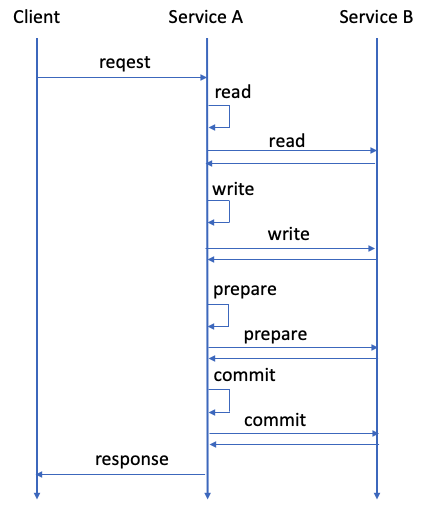
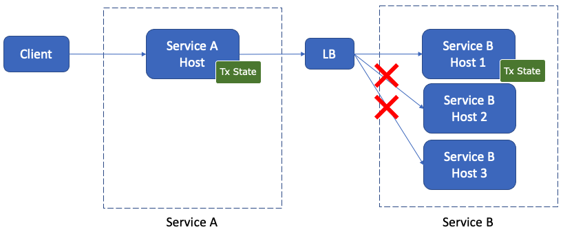

# Two-Phase Commit Transactions

ScalarDB supports executing transactions by using a two-phase interface called *two-phase commit transactions*. With two-phase commit transactions, you can execute a transaction that spans multiple processes or applications, like in a microservice architecture.

This page explains how two-phase commit transactions work in ScalarDB and how to configure and execute them in ScalarDB.

## How two-phase commit transactions work in ScalarDB

ScalarDB normally executes transactions in a single transaction manager instance with a one-phase commit interface. In transactions with a one-phase commit interface, you begin a transaction, execute CRUD operations, and commit the transaction in the same transaction manager instance.

In ScalarDB, you can execute a two-phase commit transactions that span multiple transaction manager instances. The transaction manager instances can be in the same process or application, or the instances can be in different processes or applications. For example, if you have transaction manager instances in multiple microservices, you can execute a transaction that spans multiple microservices.

In two-phase commit transactions, there are two roles—Coordinator and a participant—that collaboratively execute a single transaction.

The Coordinator process and the participant processes all have different transaction manager instances. The Coordinator process first begins or starts a transaction, and the participant processes join the transaction. After executing CRUD operations, the Coordinator process and the participant processes commit the transaction by using the two-phase interface.

## How to configure ScalarDB to support two-phase commit transactions

To enable two-phase commit transactions, you need to specify `consensus-commit` as the value for `scalar.db.transaction_manager` in the ScalarDB properties file.

The following is an example of a configuration for two-phase commit transactions when using Cassandra:

```properties
# Consensus Commit is required to support two-phase commit transactions.
scalar.db.transaction_manager=consensus-commit

# Storage implementation.
scalar.db.storage=cassandra

# Comma-separated contact points.
scalar.db.contact_points=cassandra

# Port number for all the contact points.
scalar.db.contact_port=9042

# Credential information to access the database.
scalar.db.username=cassandra
scalar.db.password=cassandra
```

For additional configurations, see [ScalarDB Configurations](configurations.md).

## How to execute two-phase commit transactions

To execute a two-phase commit transaction, you must get the transaction manager instance. Then, the Coordinator process can begin or start the transaction, and the participant can process the transaction.

### Get a `TwoPhaseCommitTransactionManager` instance

You first need to get a `TwoPhaseCommitTransactionManager` instance to execute two-phase commit transactions.

To get a `TwoPhaseCommitTransactionManager` instance, you can use `TransactionFactory` as follows:

```java
TransactionFactory factory = TransactionFactory.create("<CONFIGURATION_FILE_PATH>");
TwoPhaseCommitTransactionManager transactionManager = factory.getTwoPhaseCommitTransactionManager();
```

### Begin or start a transaction (for Coordinator)

For the process or application that begins the transaction to act as Coordinator, you should use the following `begin` method:

```java
// Begin a transaction.
TwoPhaseCommitTransaction tx = transactionManager.begin();
```

Or, for the process or application that begins the transaction to act as Coordinator, you should use the following `start` method:

```java
// Start a transaction.
TwoPhaseCommitTransaction tx = transactionManager.start();
```

Alternatively, you can use the `begin` method for a transaction by specifying a transaction ID as follows:

```java
// Begin a transaction by specifying a transaction ID.
TwoPhaseCommitTransaction tx = transactionManager.begin("<TRANSACTION_ID>");
```

Or, you can use the `start` method for a transaction by specifying a transaction ID as follows:

```java
// Start a transaction by specifying a transaction ID.
TwoPhaseCommitTransaction tx = transactionManager.start("<TRANSACTION_ID>");
```


**Note**

You must guarantee the uniqueness of the transaction ID in this case. To get the transaction ID with `getId()`, you can specify the following:

```java
tx.getId();
```


<div class="notice--info">{{ notice--info | markdownify }}</div>

### Join a transaction (for participants)

For participants, you can join a transaction by specifying the transaction ID associated with the transaction that Coordinator has started or begun as follows:

```java
TwoPhaseCommitTransaction tx = transactionManager.join("<TRANSACTION_ID>")
```

### CRUD operations for the transaction

The CRUD operations for `TwoPhaseCommitTransacton` are the same as the operations for `DistributedTransaction`. For details, see [CRUD operations](api-guide.md#crud-operations).

The following is example code for CRUD operations in two-phase commit transactions:

```java
TwoPhaseCommitTransaction tx = ...

// Retrieve the current balances by ID.
Get fromGet =
    Get.newBuilder()
        .namespace(NAMESPACE)
        .table(TABLE)
        .partitionKey(new Key(ID, fromId))
        .build();

Get toGet =
    Get.newBuilder()
        .namespace(NAMESPACE)
        .table(TABLE)
        .partitionKey(new Key(ID, toId))
        .build();

Optional<Result> fromResult = tx.get(fromGet);
Optional<Result> toResult = tx.get(toGet);

// Calculate the balances (assuming that both accounts exist).
int newFromBalance = fromResult.get().getInt(BALANCE) - amount;
int newToBalance = toResult.get().getInt(BALANCE) + amount;

// Update the balances.
Put fromPut =
    Put.newBuilder()
        .namespace(NAMESPACE)
        .table(TABLE)
        .partitionKey(new Key(ID, fromId))
        .intValue(BALANCE, newFromBalance)
        .build();

Put toPut =
    Put.newBuilder()
        .namespace(NAMESPACE)
        .table(TABLE)
        .partitionKey(new Key(ID, toId))
        .intValue(BALANCE, newToBalance)
        .build();

tx.put(fromPut);
tx.put(toPut);
```

### Prepare, commit, or roll back a transaction

After finishing CRUD operations, you need to commit the transaction. As with the standard two-phase commit protocol, there are two phases: prepare and commit.

In all the Coordinator and participant processes, you need to prepare and then commit the transaction as follows:

```java
TwoPhaseCommitTransaction tx = ...

try {
  // Execute CRUD operations in the Coordinator and participant processes.
  ...

  // Prepare phase: Prepare the transaction in all the Coordinator and participant processes.
  tx.prepare();
  ...

  // Commit phase: Commit the transaction in all the Coordinator and participant processes.
  tx.commit();
  ...
} catch (TransactionException e) {
  // If an error happens, you will need to roll back the transaction in all the Coordinator and participant processes.
  tx.rollback();
  ...
}
```

For `prepare()`, if any of the Coordinator or participant processes fail to prepare the transaction, you will need to call `rollback()` (or `abort()`) in all the Coordinator and participant processes.

For `commit()`, if any of the Coordinator or participant processes successfully commit the transaction, you can consider the transaction as committed. When a transaction has been committed, you can ignore any errors in the other Coordinator and participant processes. If all the Coordinator and participant processes fail to commit the transaction, you will need to call `rollback()` (or `abort()`) in all the Coordinator and participant processes.

For better performance, you can call `prepare()`, `commit()`, and `rollback()` in the Coordinator and participant processes in parallel, respectively.

#### Validate the transaction

Depending on the concurrency control protocol, you need to call `validate()` in all the Coordinator and participant processes after `prepare()` and before `commit()`, as shown below:

```java
// Prepare phase 1: Prepare the transaction in all the Coordinator and participant processes.
tx.prepare();
...

// Prepare phase 2: Validate the transaction in all the Coordinator and participant processes.
tx.validate();
...

// Commit phase: Commit the transaction in all the Coordinator and participant processes.
tx.commit();
...
```

Similar to `prepare()`, if any of the Coordinator or participant processes fail to validate the transaction, you will need to call `rollback()` (or `abort()`) in all the Coordinator and participant processes. In addition, you can call `validate()` in the Coordinator and participant processes in parallel for better performance.


**Note**

When using the [Consensus Commit](configurations/#consensus-commit) transaction manager with `EXTRA_READ` set as the value for `scalar.db.consensus_commit.serializable_strategy` and `SERIALIZABLE` set as the value for `scalar.db.consensus_commit.isolation_level`, you need to call `validate()`. However, if you are not using Consensus Commit, specifying `validate()` will not have any effect.


<div class="notice--info">{{ notice--info | markdownify }}</div>

### Execute a transaction by using multiple transaction manager instances

By using the APIs described above, you can execute a transaction by using multiple transaction manager instances as follows:

```java
TransactionFactory factory1 =
    TransactionFactory.create("<PATH_TO_CONFIGURATION_FILE_FOR_TRANSACTION_MANAGER_1>");
TwoPhaseCommitTransactionManager transactionManager1 =
    factory1.getTwoPhaseCommitTransactionManager();

TransactionFactory factory2 =
    TransactionFactory.create("<PATH_TO_CONFIGURATION_FILE_FOR_TRANSACTION_MANAGER_2>");
TwoPhaseCommitTransactionManager transactionManager2 =
    factory2.getTwoPhaseCommitTransactionManager();

TwoPhaseCommitTransaction transaction1 = null;
TwoPhaseCommitTransaction transaction2 = null;
try {
  // Begin a transaction.
  transaction1 = transactionManager1.begin();

  // Join the transaction begun by `transactionManager1` by getting the transaction ID.
  transaction2 = transactionManager2.join(transaction1.getId());

  // Execute CRUD operations in the transaction.
  Optional<Result> result = transaction1.get(...);
  List<Result> results = transaction2.scan(...);
  transaction1.put(...);
  transaction2.delete(...);

  // Prepare the transaction.
  transaction1.prepare();
  transaction2.prepare();

  // Validate the transaction.
  transaction1.validate();
  transaction2.validate();

  // Commit the transaction. If any of the transactions successfully commit, 
  // you can regard the transaction as committed.
  AtomicReference<TransactionException> exception = new AtomicReference<>();
  boolean anyMatch =
      Stream.of(transaction1, transaction2)
          .anyMatch(
              t -> {
                try {
                  t.commit();
                  return true;
                } catch (TransactionException e) {
                  exception.set(e);
                  return false;
                }
              });

  // If all the transactions fail to commit, throw the exception and roll back the transaction.
  if (!anyMatch) {
    throw exception.get();
  }
} catch (TransactionException e) {
  // Roll back the transaction.
  if (transaction1 != null) {
    try {
      transaction1.rollback();
    } catch (RollbackException e1) {
      // Handle the exception.
    }
  }
  if (transaction2 != null) {
    try {
    transaction2.rollback();
    } catch (RollbackException e1) {
      // Handle the exception.
    }
  }
}
```

For simplicity, the above example code doesn't handle the exceptions that the APIs may throw. For details about handling exceptions, see [How to handle exceptions](#handle-exceptions).

As previously mentioned, for `commit()`, if any of the Coordinator or participant processes succeed in committing the transaction, you can consider the transaction as committed. Also, for better performance, you can execute `prepare()`, `validate()`, and `commit()` in parallel, respectively.

### Resume a transaction

Given that processes or applications that use two-phase commit transactions usually involve multiple request and response exchanges, you might need to execute a transaction across various endpoints or APIs. For such scenarios, you can use `resume()` to resume a transaction object (an instance of `TwoPhaseCommitTransaction`) that you previously began or joined.

The following shows how `resume()` works:

```java
// Join (or begin) the transaction.
TwoPhaseCommitTransaction tx = transactionManager.join("<TRANSACTION_ID>");

...

// Resume the transaction by using the transaction ID.
TwoPhaseCommitTransaction tx1 = transactionManager.resume("<TRANSACTION_ID>")
```

The following is an example of two services that have multiple endpoints:

```java
interface ServiceA {
  void facadeEndpoint() throws Exception;
}

interface ServiceB {
  void endpoint1(String txId) throws Exception;

  void endpoint2(String txId) throws Exception;

  void prepare(String txId) throws Exception;

  void commit(String txId) throws Exception;

  void rollback(String txId) throws Exception;
}
```

The following is an example of a client calling `ServiceA.facadeEndpoint()` that begins a transaction that spans the two services (`ServiceA` and `ServiceB`):

```java
public class ServiceAImpl implements ServiceA {

  private TwoPhaseCommitTransactionManager transactionManager = ...;
  private ServiceB serviceB = ...;

  ...

  @Override
  public void facadeEndpoint() throws Exception {
    TwoPhaseCommitTransaction tx = transactionManager.begin();

    try {
      ...

      // Call `ServiceB` `endpoint1`.
      serviceB.endpoint1(tx.getId());

      ...

      // Call `ServiceB` `endpoint2`.
      serviceB.endpoint2(tx.getId());

      ...

      // Prepare.
      tx.prepare();
      serviceB.prepare(tx.getId());

      // Commit.
      tx.commit();
      serviceB.commit(tx.getId());
    } catch (Exception e) {
      // Roll back.
      tx.rollback();
      serviceB.rollback(tx.getId());
    }
  }
}
```

As shown above, the facade endpoint in `ServiceA` calls multiple endpoints (`endpoint1()`, `endpoint2()`, `prepare()`, `commit()`, and `rollback()`) of `ServiceB`. In addition, in two-phase commit transactions, you need to use the same transaction object across the endpoints.

In this situation, you can resume the transaction. The implementation of `ServiceB` is as follows:

```java
public class ServiceBImpl implements ServiceB {

  private TwoPhaseCommitTransactionManager transactionManager = ...;

  ...

  @Override
  public void endpoint1(String txId) throws Exception {
    // Join the transaction.
    TwoPhaseCommitTransaction tx = transactionManager.join(txId);
  }

  @Override
  public void endpoint2(String txId) throws Exception {
    // Resume the transaction that you joined in `endpoint1()`.
    TwoPhaseCommitTransaction tx = transactionManager.resume(txId);
  }

  @Override
  public void prepare(String txId) throws Exception {
    // Resume the transaction.
    TwoPhaseCommitTransaction tx = transactionManager.resume(txId);

    ...

    // Prepare.
    tx.prepare();
  }

  @Override
  public void commit(String txId) throws Exception {
    // Resume the transaction.
    TwoPhaseCommitTransaction tx = transactionManager.resume(txId);

    ...

    // Commit.
    tx.commit();
  }

  @Override
  public void rollback(String txId) throws Exception {
    // Resume the transaction.
    TwoPhaseCommitTransaction tx = transactionManager.resume(txId);

    ...

    // Roll back.
    tx.rollback();
  }
}
```

As shown above, by resuming the transaction, you can share the same transaction object across multiple endpoints in `ServiceB`.

## How to handle exceptions

When executing a transaction by using multiple transaction manager instances, you will also need to handle exceptions properly.


**Attention**

If you don't handle exceptions properly, you may face anomalies or data inconsistency.


<div class="notice--warning">{{ notice--warning | markdownify }}</div>

For instance, in the example code in [Execute a transaction by using multiple transaction manager instances](#execute-a-transaction-by-using-multiple-transaction-manager-instances), multiple transaction managers (`transactionManager1` and `transactionManager2`) are used in a single process for ease of explanation. However, that example code doesn't include a way to handle exceptions.

The following example code shows how to handle exceptions in two-phase commit transactions:

```java
public class Sample {
  public static void main(String[] args) throws Exception {
    TransactionFactory factory1 =
        TransactionFactory.create("<PATH_TO_CONFIGURATION_FILE_FOR_TRANSACTION_MANAGER_1>");
    TwoPhaseCommitTransactionManager transactionManager1 =
        factory1.getTwoPhaseCommitTransactionManager();

    TransactionFactory factory2 =
        TransactionFactory.create("<PATH_TO_CONFIGURATION_FILE_FOR_TRANSACTION_MANAGER_2>");
    TwoPhaseCommitTransactionManager transactionManager2 =
        factory2.getTwoPhaseCommitTransactionManager();

    int retryCount = 0;
    TransactionException lastException = null;

    while (true) {
      if (retryCount++ > 0) {
        // Retry the transaction three times maximum in this sample code.
        if (retryCount >= 3) {
          // Throw the last exception if the number of retries exceeds the maximum.
          throw lastException;
        }

        // Sleep 100 milliseconds before retrying the transaction in this sample code.
        TimeUnit.MILLISECONDS.sleep(100);
      }

      TwoPhaseCommitTransaction transaction1 = null;
      TwoPhaseCommitTransaction transaction2 = null;
      try {
        // Begin a transaction.
        transaction1 = transactionManager1.begin();

        // Join the transaction that `transactionManager1` begun by using the transaction ID.
        transaction2 = transactionManager2.join(transaction1.getId());

        // Execute CRUD operations in the transaction.
        Optional<Result> result = transaction1.get(...);
        List<Result> results = transaction2.scan(...);
        transaction1.put(...);
        transaction2.delete(...);

        // Prepare the transaction.
        prepare(transaction1, transaction2);

        // Validate the transaction.
        validate(transaction1, transaction2);

        // Commit the transaction.
        commit(transaction1, transaction2);
      } catch (UnsatisfiedConditionException e) {
        // You need to handle `UnsatisfiedConditionException` only if a mutation operation specifies 
        // a condition. This exception indicates the condition for the mutation operation is not met.

        rollback(transaction1, transaction2);

        // You can handle the exception here, according to your application requirements.

        return;
      } catch (UnknownTransactionStatusException e) {
        // If you catch `UnknownTransactionStatusException` when committing the transaction, 
        // it indicates that the status of the transaction, whether it was successful or not, is unknown.
        // In such a case, you need to check if the transaction is committed successfully or not and 
        // retry the transaction if it failed. How to identify a transaction status is delegated to users.
        return;
      } catch (TransactionException e) {
        // For other exceptions, you can try retrying the transaction.

        // For `CrudConflictException`, `PreparationConflictException`, `ValidationConflictException`, 
        // `CommitConflictException`, and `TransactionNotFoundException`, you can basically retry the 
        // transaction. However, for the other exceptions, the transaction will still fail if the cause of 
        // the exception is non-transient. In such a case, you will exhaust the number of retries and 
        // throw the last exception.

        rollback(transaction1, transaction2);

        lastException = e;
      }
    }
  }

  private static void prepare(TwoPhaseCommitTransaction... transactions)
      throws TransactionException {
    // You can execute `prepare()` in parallel.
    List<TransactionException> exceptions =
        Stream.of(transactions)
            .parallel()
            .map(
                t -> {
                  try {
                    t.prepare();
                    return null;
                  } catch (TransactionException e) {
                    return e;
                  }
                })
            .filter(Objects::nonNull)
            .collect(Collectors.toList());

    // If any of the transactions failed to prepare, throw the exception.
    if (!exceptions.isEmpty()) {
      throw exceptions.get(0);
    }
  }

  private static void validate(TwoPhaseCommitTransaction... transactions)
      throws TransactionException {
    // You can execute `validate()` in parallel.
    List<TransactionException> exceptions =
        Stream.of(transactions)
            .parallel()
            .map(
                t -> {
                  try {
                    t.validate();
                    return null;
                  } catch (TransactionException e) {
                    return e;
                  }
                })
            .filter(Objects::nonNull)
            .collect(Collectors.toList());

    // If any of the transactions failed to validate, throw the exception.
    if (!exceptions.isEmpty()) {
      throw exceptions.get(0);
    }
  }

  private static void commit(TwoPhaseCommitTransaction... transactions)
      throws TransactionException {
    // You can execute `commit()` in parallel.
    List<TransactionException> exceptions =
        Stream.of(transactions)
            .parallel()
            .map(
                t -> {
                  try {
                    t.commit();
                    return null;
                  } catch (TransactionException e) {
                    return e;
                  }
                })
            .filter(Objects::nonNull)
            .collect(Collectors.toList());

    // If any of the transactions successfully committed, you can regard the transaction as committed.
    if (exceptions.size() < transactions.length) {
      if (!exceptions.isEmpty()) {
        // You can log the exceptions here if you want.
      }

      return; // Commit was successful.
    }

    //
    // If all the transactions failed to commit:
    //

    // If any of the transactions failed to commit due to `UnknownTransactionStatusException`, throw
    // it because you should not retry the transaction in such a case.
    Optional<TransactionException> unknownTransactionStatusException =
        exceptions.stream().filter(e -> e instanceof UnknownTransactionStatusException).findFirst();
    if (unknownTransactionStatusException.isPresent()) {
      throw unknownTransactionStatusException.get();
    }

    // Otherwise, throw the first exception.
    throw exceptions.get(0);
  }

  private static void rollback(TwoPhaseCommitTransaction... transactions) {
    Stream.of(transactions)
        .parallel()
        .filter(Objects::nonNull)
        .forEach(
            t -> {
              try {
                t.rollback();
              } catch (RollbackException e) {
                // Rolling back the transaction failed. The transaction should eventually recover,
                // so you don't need to do anything further. You can simply log the occurrence here.
              }
            });
  }
}
```

### `TransactionException` and `TransactionNotFoundException`

The `begin()` API could throw `TransactionException` or `TransactionNotFoundException`:

- If you catch `TransactionException`, this exception indicates that the transaction has failed to begin due to transient or non-transient faults. You can try retrying the transaction, but you may not be able to begin the transaction due to non-transient faults.
- If you catch `TransactionNotFoundException`, this exception indicates that the transaction has failed to begin due to transient faults. In this case, you can retry the transaction.

The `join()` API could also throw `TransactionNotFoundException`. You can handle this exception in the same way that you handle the exceptions for the `begin()` API.

### `CrudException` and `CrudConflictException`

The APIs for CRUD operations (`get()`, `scan()`, `put()`, `delete()`, and `mutate()`) could throw `CrudException` or `CrudConflictException`:

- If you catch `CrudException`, this exception indicates that the transaction CRUD operation has failed due to transient or non-transient faults. You can try retrying the transaction from the beginning, but the transaction will still fail if the cause is non-transient.
- If you catch `CrudConflictException`, this exception indicates that the transaction CRUD operation has failed due to transient faults (for example, a conflict error). In this case, you can retry the transaction from the beginning.

### `UnsatisfiedConditionException`

The APIs for mutation operations (`put()`, `delete()`, and `mutate()`) could also throw `UnsatisfiedConditionException`.

If you catch `UnsatisfiedConditionException`, this exception indicates that the condition for the mutation operation is not met. You can handle this exception according to your application requirements.

### `PreparationException` and `PreparationConflictException`

The `prepare()` API could throw `PreparationException` or `PreparationConflictException`:

- If you catch `PreparationException`, this exception indicates that preparing the transaction fails due to transient or non-transient faults. You can try retrying the transaction from the beginning, but the transaction will still fail if the cause is non-transient.
- If you catch `PreparationConflictException`, this exception indicates that preparing the transaction has failed due to transient faults (for example, a conflict error). In this case, you can retry the transaction from the beginning.

### `ValidationException` and `ValidationConflictException`

The `validate()` API could throw `ValidationException` or `ValidationConflictException`:

- If you catch `ValidationException`, this exception indicates that validating the transaction fails due to transient or non-transient faults. You can try retrying the transaction from the beginning, but the transaction will still fail if the cause is non-transient.
- If you catch `ValidationConflictException`, this exception indicates that validating the transaction has failed due to transient faults (for example, a conflict error). In this case, you can retry the transaction from the beginning.

### `CommitException`, `CommitConflictException`, and `UnknownTransactionStatusException`

The `commit()` API could throw `CommitException`, `CommitConflictException`, or `UnknownTransactionStatusException`:

- If you catch `CommitException`, this exception indicates that committing the transaction fails due to transient or non-transient faults. You can try retrying the transaction from the beginning, but the transaction will still fail if the cause is non-transient.
- If you catch `CommitConflictException`, this exception indicates that committing the transaction has failed due to transient faults (for example, a conflict error). In this case, you can retry the transaction from the beginning.
- If you catch `UnknownTransactionStatusException`, this exception indicates that the status of the transaction, whether it was successful or not, is unknown. In this case, you need to check if the transaction is committed successfully and retry the transaction if it has failed.

How to identify a transaction status is delegated to users. You may want to create a transaction status table and update it transactionally with other application data so that you can get the status of a transaction from the status table.

### Notes about some exceptions

Although not illustrated in the example code, the `resume()` API could also throw `TransactionNotFoundException`. This exception indicates that the transaction associated with the specified ID was not found and/or the transaction might have expired. In either case, you can retry the transaction from the beginning since the cause of this exception is basically transient.

In the sample code, for `UnknownTransactionStatusException`, the transaction is not retried because the application must check if the transaction was successful to avoid potential duplicate operations. For other exceptions, the transaction is retried because the cause of the exception is transient or non-transient. If the cause of the exception is transient, the transaction may succeed if you retry it. However, if the cause of the exception is non-transient, the transaction will still fail even if you retry it. In such a case, you will exhaust the number of retries.


**Note**

If you begin a transaction by specifying a transaction ID, you must use a different ID when you retry the transaction.

In addition, in the sample code, the transaction is retried three times maximum and sleeps for 100 milliseconds before it is retried. But you can choose a retry policy, such as exponential backoff, according to your application requirements.


<div class="notice--info">{{ notice--info | markdownify }}</div>

## Request routing in two-phase commit transactions

Services that use two-phase commit transactions usually execute a transaction by exchanging multiple requests and responses, as shown in the following diagram:



In addition, each service typically has multiple servers (or hosts) for scalability and availability and uses server-side (proxy) or client-side load balancing to distribute requests to the servers. In such a case, since transaction processing in two-phase commit transactions is stateful, requests in a transaction must be routed to the same servers while different transactions need to be distributed to balance the load, as shown in the following diagram:



There are several approaches to achieve load balancing for two-phase commit transactions depending on the protocol between the services. Some approaches for this include using gRPC and HTTP/1.1.

### gPRC

When you use a client-side load balancer, you can use the same gRPC connection to send requests in a transaction, which guarantees that the requests go to the same servers.

When you use a server-side (proxy) load balancer, solutions are different between an L3/L4 (transport-level) load balancer and an L7 (application-level) load balancer:

- When using an L3/L4 load balancer, you can use the same gRPC connection to send requests in a transaction, similar to when you use a client-side load balancer. In this case, requests in the same gRPC connection always go to the same server.
- When using an L7 load balancer, since requests in the same gRPC connection don't necessarily go to the same server, you need to use cookies or similar method to route requests to the correct server.
  - For example, if you use [Envoy](https://www.envoyproxy.io/), you can use session affinity (sticky session) for gRPC. Alternatively, you can use [bidirectional streaming RPC in gRPC](https://grpc.io/docs/what-is-grpc/core-concepts/#bidirectional-streaming-rpc) since the L7 load balancer distributes requests in the same stream to the same server.

For more details about load balancing in gRPC, see [gRPC Load Balancing](https://grpc.io/blog/grpc-load-balancing/).

### HTTP/1.1

Typically, you use a server-side (proxy) load balancer with HTTP/1.1:

- When using an L3/L4 load balancer, you can use the same HTTP connection to send requests in a transaction, which guarantees the requests go to the same server.
- When using an L7 load balancer, since requests in the same HTTP connection don't necessarily go to the same server, you need to use cookies or similar method to route requests to the correct server.
You can use session affinity (sticky session) in that case.

## Hands-on tutorial

One of the use cases for two-phase commit transactions is microservice transactions. For a hands-on tutorial, see [Create a Sample Application That Supports Microservice Transactions](https://github.com/scalar-labs/scalardb-samples/tree/main/microservice-transaction-sample).
