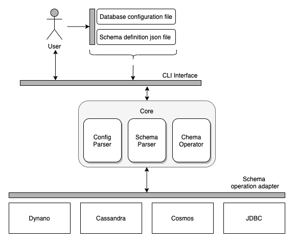

# Scalar DB Schema Tool Design Document
## Introduction
This document provides the design of Scalar DB schema tool, including dependency components, requirements, constraints, goals, architecture and detailed modules.
## System Overview
Scalar DB schema tool is a Java CLI application using for manipulating schemas in specify databases which Scalar DB currently supported including Cosmos DB, Dynamo DB, Cassandra DB and JDBC database (MySQL, Postgres).
## Design Considerations
### Assumptions and Dependencies
- Application will be written in Java.
- Using CLI with optional arguments as user interface.
- Configuration options are consistent with `database.properties` comes from Scalar DB.
- Schema defines in json file with a dedicated format as input.
### General constraints
- Achieving the same feature set as the previous tool written in Clojure.
- Using the Admin modules from Scalar DB library as core functions for creating schemas.
- Supporting Cosmos DB, Dynamo DB, Cassandra DB and JDBC database (MySQL, Postgres).
- Supporting the clustering key ordering in case of backend database supported.
- Do not re-insert the coordinator schema if it already exists when running the tool to insert a transaction-able table.
### Goals
- For Cosmos DB, this tool creates databases (collections) and tables(containers), also inserts metadata which is required by Scalar DB.
- For DynamoDB, this tool creates tables named with the database names and table names, also inserts metadata which is required by Scalar DB.
- For Cassandra, this tool creates databases (keyspaces) and tables. The compaction strategy, the network topology strategy, and the replication factor and be specified as well.
- For a JDBC database, this tool creates databases(schemas, except Oracle) and tables, also inserts metadata which is required by Scalar DB.
- Automatically adds Scalar DB transaction metadata when the `transaction` parameter set to `true` in the schema file.
- Deleting schemas can be performed easily through cli arguments as well.
- Extending for supporting new database can be achieved easily.
## Architecture
Blocks diagram

## Detailed Design
### Data type mapping between Scalar DB and the other databases
Data types in Scalar DB and their mapping to the data types of other databases.

| Scalar DB | Cassandra | Cosmos DB      | DynamoDB | MySQL    | PostgreSQL       | Oracle         | SQL Server      |
| --------- | --------- | -------------- | ---------| -------- | ---------------- | -------------- | --------------- |
| BOOLEAN   | boolean   | boolean (JSON) | BOOL     | boolean  | boolean          | number(1)      | bit             |
| INT       | int       | number (JSON)  | N        | int      | int              | int            | int             |
| BIGINT    | bigint    | number (JSON)  | N        | bigint   | bigint           | number(19)     | bigint          |
| FLOAT     | float     | number (JSON)  | N        | float    | float            | binary_float   | float(24)       |
| DOUBLE    | double    | number (JSON)  | N        | double   | double precision | binary_double  | float           |
| TEXT      | text      | string (JSON)  | S        | longtext | text             | varchar2(4000) | varchar(8000)   |
| BLOB      | blob      | string (JSON)  | B        | longblob | bytea            | blob           | varbinary(8000) |
### Scaling Performance
#### RU
Scaling the throughput of Cosmos DB and DynamoDB by specifying `-r` option (which applies to all the tables) or `ru` parameter for each table. Those configurations are ignored in Cassandra. The default values are `400` for Cosmos DB and `10` for DynamoDB respectively, which are set without `-r` option.

Note that the schema tool abstracts [Request Unit](https://docs.microsoft.com/azure/cosmos-db/request-units) of Cosmos DB and [Capacity Unit](https://docs.aws.amazon.com/amazondynamodb/latest/developerguide/HowItWorks.ReadWriteCapacityMode.html#HowItWorks.ProvisionedThroughput.Manual) of DynamoDB with `RU`.
So, please set an appropriate value depending on the database implementations. Please also note that the schema tool sets the same value to both Read Capacity Unit and Write Capacity Unit for DynamoDB.
#### Auto-scaling
By default, the schema tool enables auto-scaling of RU for all tables: RU is scaled in or out between 10% and 100% of a specified RU depending on a workload. For example, if you specify `-r 10000`, RU of each table is scaled in or out between 1000 and 10000. Note that auto-scaling of Cosmos DB is enabled only when you set more than or equal to 4000 RU.

### Schema file sample
```json
{
  "sample_db.sample_table": {
    "partition-key": [
      "c1"
    ],
    "clustering-key": [
      "c4 DESC",
      "c6 ASC"
    ],
    "columns": {
      "c1": "INT",
      "c2": "TEXT",
      "c3": "BLOB",
      "c4": "INT",
      "c5": "BOOLEAN",
      "c6": "INT"
    },
    "ru": 5000,
    "compaction-strategy": "LCS",
    "secondary-index": [
      "c2",
      "c4"
    ]
  },

  "sample_db.sample_table1": {
    "transaction": true,
    "partition-key": [
      "c1"
    ],
    "clustering-key": [
      "c4"
    ],
    "columns": {
      "c1": "INT",
      "c2": "TEXT",
      "c3": "INT",
      "c4": "INT",
      "c5": "BOOLEAN"
    }
  },

  "sample_db.sample_table2": {
    "transaction": false,
    "partition-key": [
      "c1"
    ],
    "clustering-key": [
      "c4",
      "c3"
    ],
    "columns": {
      "c1": "INT",
      "c2": "TEXT",
      "c3": "INT",
      "c4": "INT",
      "c5": "BOOLEAN"
    }
  }
}
```
- `compaction-strategy` should be `STCS`, `LCS` or `TWCS`. This is ignored in Cosmos DB and DynamoDB.
- This `ru` value is set for all tables on this database even if `-r BASE_RESOURCE_UNIT` is set when Cosmos DB and DynamoDB. `ru` is ignored in Cassandra.
- The order of clustering key can be set to `ASC` or `DESC`. Default value will be `ASC`.
### Libraries
- [picocli](https://github.com/remkop/picocli) for command line interface.
- Admin module from [Scalar DB library](https://github.com/scalar-labs/scalardb/blob/master/core/src/main/java/com/scalar/db/service/AdminService.java) as core.
- [guice](https://github.com/google/guice) for dependency injection.